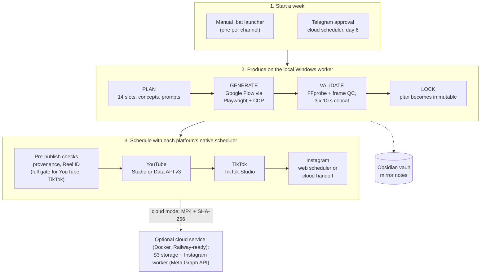
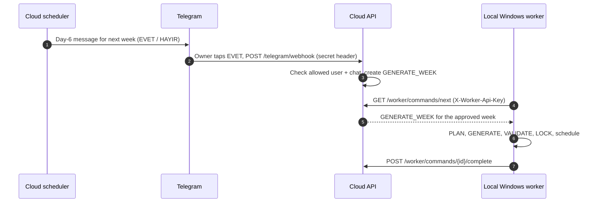

# Reels AI Factory (otomasyon_3)

A Python automation that plans, generates, quality-checks and schedules a week of short vertical videos (Reels / Shorts) on YouTube, TikTok and Instagram, with an Obsidian vault as the production log and an optional small cloud service for Telegram approvals.

[](https://github.com/CoskunerBerke/otomasyon_3/actions/workflows/ci.yml)


> **Status:** personal automation project, used for the weekly schedule of two of my own channels
> (BuildVerse and Crafts By Man). The production pipeline is Windows-first (real Chrome sessions,
> `.bat` launchers); the test suite, the offline dry run and the cloud control plane also run on Linux.

**Contents:** [Overview](#overview) · [How it works](#how-it-works) · [Features](#features) · [Sample output](#sample-output) · [Tech stack](#tech-stack) · [Project structure](#project-structure) · [Quick start](#quick-start) · [Configuration](#configuration) · [Testing](#testing) · [Deployment](#deployment) · [Security](#security) · [Status and roadmap](#status-and-roadmap) · [Türkçe](#türkçe)

## Overview

Every week the factory produces a 14-Reel series (7 days × 2 time slots) per channel. It picks concepts from curated libraries using the channel's own publishing history, so a concept rests before it comes back, builds English video prompts from templates, drives the **Google Flow** web app with Playwright to generate the clips, validates and assembles the final MP4 with FFmpeg, and then uses each platform's **native scheduler**, so nothing has to be online at publish time. An Obsidian vault mirrors the production log (the older `run.py` generator also reads past Reels from it to avoid repeating topics). An optional cloud service, packaged with Docker and ready for Railway (`railway.toml`) but not currently deployed, adds Telegram approvals, a command queue for the local worker and an Instagram worker.

## How it works

In short (the full walkthrough with diagrams, formulas, thresholds and code links is in **[docs/HOW_IT_WORKS.md](docs/HOW_IT_WORKS.md)**):

- **Plan:** 14 slots (19:30 and 22:00 Europe/Istanbul) starting the day after the channel's last scheduled video. Concepts are ordered by how long they have rested; the required rest scales with the size of the concept pool (up to 21 days), and a week that would repeat a concept within 7 days is refused.
- **Generate:** one Flow project per Reel and three 10 s segments whose prompts repeat the same description of the place, materials and light. A polling state machine downloads only a video that was not on screen before Generate was clicked, and never picks the paid upscaled downloads.
- **Validate and lock:** ffprobe stream and 9:16 checks, frame sampling for black, empty or frozen video, and a per-mode audio policy; two identical failures in a row stop generation. The plan is locked only when all 14 Reels are QC-passed Flow output.
- **Schedule:** a full pre-publish gate before each YouTube and TikTok upload (provenance, Reel ID invariant, placeholder metadata, slot, SHA-256) and a narrower one on both Instagram routes (provenance and Reel ID; metadata is checked at lock). Each YouTube and TikTok attempt is recorded before the upload, then each platform's own scheduler is used. A submit whose confirmation could not be read is recorded as unverified, not as a success; Instagram's is never retried, and YouTube Studio re-checks before it resumes.
- **Resume:** every step is written under `workspace/`, so running the same launcher again continues where it stopped.



Generation must finish for all 14 Reels before the plan is locked, and nothing is uploaded before the lock (`automation/simple_weekly_pipeline.py`). The platforms then run one after another; a platform that cannot reach 14/14 is held for up to 30 minutes for a manual fix before the next one starts. The optional cloud path for starting a week (the local worker polls only when started with `python -m automation.local_worker --run-once`):



## Features

- **Weekly pipeline**: `PLAN → GENERATE → VALIDATE → LOCK → YOUTUBE → TIKTOK → INSTAGRAM → DONE`; the content plan is immutable once locked, and platform progress is tracked separately so it can never rewrite the plan.
- **Idea and prompt engine**: topic history and diversity scoring, four content modes (`silent_global_step_by_step`, `narrative_ambient_story`, `hidden_build_story`, `cutaway_reveal_story`).
- **Google Flow automation**: connects to a real Chrome session over CDP, sets 9:16, submits prompts, resumes and downloads segments, and never picks the paid upscale entries in the download menu. It stops with `USER_ACTION_REQUIRED` instead of bypassing logins or CAPTCHAs.
- **Quality control**: FFprobe checks (a video stream and a 9:16 aspect ratio), frame sampling for black, empty or frozen video, audio handling per content mode, faststart, and 3 × 10 s segment concatenation into a 30 s Reel.
- **Publishing**: YouTube (Studio or Data API v3), TikTok Studio and Instagram (web scheduler or Meta Graph API), with AI-content disclosure on every route and, in YouTube Data API mode, localized titles and descriptions (`tr`, `hi`, `id`, `ja`) for story and cutaway Reels.
- **Safety by design**: idempotent uploads (per-Reel, per-platform progress, YouTube and TikTok attempts recorded before the upload, SHA-256 checks), pre-publish checks that block test media and mismatched Reel IDs on every route (placeholder metadata is refused at lock and again before each YouTube and TikTok upload), per-platform failure isolation, never clicks "post now", never deletes remote content, brand isolation, and a process lock with a 14-video cap in the generation CLI (`run.py`).
- **Multi-brand**: each channel has its own accounts, Chrome profiles, ports, ID prefix (`CBM-` for Crafts By Man) and inventory.
- **Obsidian integration**: the weekly pipeline mirrors each Reel into the vault; the older CLIs (`run.py`, `publish.py`) move Reel notes through `03_SCRIPTS → 04_PRODUCTION → 05_READY / 07_REJECTED` and write a publishing queue, an agent control center and graph-view links.
- **Cloud control plane** (optional; Docker image, ready for Railway): standard-library HTTP service with Telegram webhook approvals, a weekly scheduler, a local-worker command queue, S3-compatible media storage and a `/health` endpoint.
- **Test suite**: 1,000+ offline pytest cases, including regression tests for past production incidents; CI runs them on every push.

## Sample output

The project has no web UI (its interfaces are the Obsidian vault, Telegram buttons and the platforms' own studios), so there are no screenshots here. This is real output of the offline dry run from the [quick start](#quick-start), trimmed only where marked with `...`. It used an empty demo vault: no browser, no Flow credits, nothing uploaded. The Turkish console lines are the tool's own.

```text
[3/8] Konseptler belirleniyor...

      [YENİ]  REEL-2026-0001 Futuristic City Build (Diversity Score: 0.78)

[4/8] Obsidian senaryo notları kontrol ediliyor...

Oluşturuldu: REEL-2026-0001.md (status: PROMPT_READY)
      REEL-2026-0001 -> 03_SCRIPTS/REEL-2026-0001.md

========================================
         DRY RUN TAMAMLANDI
========================================

REEL-2026-0001
Concept: Futuristic City Build (Satisfying Transformation)
Diversity Score: 0.78

SEGMENT 1/3
Duration: 10s
Goal: FOUNDATION
Starting: empty vast terrain in empty barren plains, raw undeveloped land
Action:   underground infrastructure excavation, subterranean transit grids mapping, heavy concrete foundation slabs pouring, initial structural columns rising
Ending:   active multi-block foundation grid with exposed steel framing and lower structural columns (unfinished, no upper towers yet)

SEGMENT 2/3
Duration: 10s
Goal: MAIN_CONSTRUCTION
...
SEGMENT 3/3
Duration: 10s
Goal: DETAILS_AND_REVEAL
...
FINAL:
30 seconds
9:16 vertical
Silent (Audio: False)
----------------------------------------

Obsidian senaryoları ve promptlar hazırlandı.
Google Flow açılmadı, kredi harcanmadı.
```

The same run writes the Reel note (`03_SCRIPTS/REEL-2026-0001.md`, with YAML front matter for status, segments and prompt hashes), one note per segment and an agent run log into the vault.

## Tech stack

| Area | Tools |
|---|---|
| Language | Python 3.10+ (CI tests 3.10 and 3.11; Docker image: 3.11) |
| Browser automation | Playwright (real Chrome over CDP) |
| Media | FFmpeg / FFprobe, Pillow, NumPy |
| Platforms | YouTube Data API v3 (google-api-python-client, OAuth), TikTok Studio, Instagram web + Meta Graph API |
| Cloud | Python `http.server`, PostgreSQL (psycopg) or SQLite, boto3 (S3-compatible storage), Telegram Bot API |
| Knowledge base | Obsidian (Markdown notes, graph view) |
| Ops | Docker image with a Railway config (`railway.toml`), GitHub Actions, Windows `.bat` launchers, pytest |

## Project structure

```text
automation/
├── simple_weekly_pipeline.py   # live weekly entry point (phase by phase)
├── run.py, publish.py          # generation / publishing CLIs (both have --dry-run)
├── local_worker.py             # polls the cloud command queue
├── brands.py                   # per-channel accounts, profiles, ID prefixes
├── agents/                     # history, idea, segment planner, flow, quality, publish agents
├── content/                    # concepts, content modes, prompt engine, diversity rules
├── flow/                       # Google Flow browser automation
├── quality/                    # ffprobe checks, frame analysis, concatenation
├── publishing/                 # YouTube, TikTok, Instagram publishers + eligibility / pre-publish gates
├── orchestration/              # weekly manifests, slots, state, reconciliation
├── obsidian/                   # vault reader / writer
└── cloud/                      # optional control plane (Docker, Railway-ready): HTTP app, Telegram, scheduler, workers, storage
tests/                          # pytest suite (offline, mocks only)
docs/                           # HOW_IT_WORKS.md (engineering deep dive); RAILWAY_DEPLOYMENT.md, TELEGRAM_SETUP.md (Turkish)
.github/workflows/ci.yml        # CI: FFmpeg + pytest on Python 3.10 and 3.11
*.bat                           # one-click Windows launchers
```

## Quick start

### Try it offline (Linux, macOS or Windows)

Needs Python 3.10+ and, for the QC tests only, FFmpeg on `PATH`. Nothing here opens a browser, spends Flow credits, uploads or sends a Telegram message. Commands are for a POSIX shell; on Windows activate with `.venv\Scripts\activate` and use your own demo folder.

```bash
git clone https://github.com/CoskunerBerke/otomasyon_3.git && cd otomasyon_3
python3 -m venv .venv && . .venv/bin/activate
pip install -r requirements.txt

# 1. Test suite
python -m pytest -q tests/

# 2. Offline generation dry run against an empty demo vault
mkdir -p /tmp/reels-demo/vault
cat > /tmp/reels-demo/config.json <<'EOF'
{"vault_path": "/tmp/reels-demo/vault", "output_path": "/tmp/reels-demo/output",
 "chrome_profile_path": "/tmp/reels-demo/chrome-profile", "videos_per_run": 1}
EOF
python automation/run.py --count 1 --dry-run --config /tmp/reels-demo/config.json

# 3. Cloud control plane locally (SQLite in ./workspace, no Telegram token)
APP_ENV=development python -m automation.cloud.app --host 127.0.0.1 --port 8000 &
curl -s http://127.0.0.1:8000/health
```

`/health` returns sanitized status only; this is the response from that local run:

```json
{"status": "HEALTHY", "database": "CONNECTED", "weekly_scheduler": "DISABLED", "instagram_worker": "DISABLED",
 "instagram_dry_run": true, "instagram_allow_upload": false, "instagram_allow_publish": false,
 "telegram_configured": false, "storage_configured": true, "local_worker_online": false,
 "media_storage_backend": "local", "timezone": "Europe/Istanbul",
 "current_time_utc": "2026-09-30 22:41:45 UTC", "current_time_istanbul": "2026-10-01 01:41:45 Europe/Istanbul"}
```

### Production setup (Windows)

Requirements: Windows 10/11, Python 3.10+, FFmpeg and FFprobe on `PATH`, a Google account with Flow access, and an Obsidian vault.

1. `INSTALL_FIRST_TIME.bat` creates `.venv`, installs `requirements.txt` and Playwright Chromium, and prepares `config.local.json` (template: `config.example.json`).
2. `FLOW_LOGIN.bat` opens a dedicated Chrome profile; sign in to Google Flow manually and leave the window open.
3. `BUILDVERSE_GIRIS.bat` / `CRAFTSBYMAN_GIRIS.bat` sign in to each channel's platforms once.
4. Rehearse without spending credits or uploading:

```powershell
.venv\Scripts\python automation\run.py --count 1 --dry-run
.venv\Scripts\python automation\publish.py --count 14 --dry-run
.venv\Scripts\python -m pytest -q tests\
```

5. Weekly run: `BUILDVERSE_HAFTALIK_14_REEL.bat` or `CRAFTSBYMAN_HAFTALIK_14_REEL.bat`; the `*_SADECE_*` launchers finish a single platform for a half-done week (the Crafts By Man ones are pinned to week `CBM-2026-W34`).

If Google Flow's UI changes, error screenshots and HTML are saved under `screenshots/errors/`, and selectors live in `automation/flow/selectors.py`.

## Configuration

Local generation and publishing read `config.local.json` / `publishing.local.json` (git-ignored; template `config.example.json`). The cloud control plane reads environment variables (templates: `.env.example`, `.env.railway.example`; a local `.env` is loaded if present). Names only here; never commit values.

| Variable | Purpose |
|---|---|
| `APP_ENV` | `production` turns on hard gates: PostgreSQL and the webhook secret become mandatory |
| `PORT` | HTTP port (set by the host, for example Railway; default 8000) |
| `APP_TIMEZONE` | Scheduling timezone (default `Europe/Istanbul`) |
| `DATABASE_URL` | PostgreSQL URL in production; `sqlite:///...` for local development |
| `TELEGRAM_BOT_TOKEN` | Bot that sends the approval message |
| `TELEGRAM_ALLOWED_USER_ID`, `TELEGRAM_CHAT_ID` | Only this user in this chat can approve or reject a week. No default: while either is unset, every button press is refused (and without `TELEGRAM_CHAT_ID` no approval message is sent) |
| `TELEGRAM_WEBHOOK_SECRET` | Expected `X-Telegram-Bot-Api-Secret-Token` header (`python -m automation.cloud.generate_webhook_secret`) |
| `ENABLE_TELEGRAM_WEBHOOK` | `false` closes `/telegram/webhook` (503) |
| `PUBLIC_BASE_URL` | HTTPS URL of the cloud service (used by the local worker and the webhook setup) |
| `WEEKLY_APPROVAL_LOCAL_TIME` | Time of day the approval message is sent on day 6 |
| `ENABLE_WEEKLY_SCHEDULER`, `ENABLE_INSTAGRAM_WORKER` | Background subsystems, off by default |
| `LOCAL_WORKER_API_KEY` | Shared key for the `/worker/*` endpoints; empty or a template value (`change-me`) keeps them closed |
| `MEDIA_STORAGE_BACKEND` | `local` or `s3` |
| `S3_ENDPOINT_URL`, `S3_BUCKET`, `S3_ACCESS_KEY_ID`, `S3_SECRET_ACCESS_KEY`, `S3_REGION` | S3-compatible private bucket (for example a Railway Storage bucket) |
| `META_GRAPH_VERSION`, `META_ACCESS_TOKEN` | Meta Graph API access for the cloud Instagram worker and the local Instagram preflight |
| `META_APP_ID`, `META_APP_SECRET` | Read only by the local Instagram tools (`automation.publishing.instagram_preflight`, `instagram_live_test`); no API call uses them and the cloud service does not read them |
| `INSTAGRAM_ACCOUNT_ID`, `INSTAGRAM_EXPECTED_USERNAME` | Target account, no default. The Railway and Instagram preflights fail on template values. The Railway preflight also fails while either is unset; the Instagram preflight needs the username (it can discover an unset ID from linked Pages) and fails if the account belongs to another username |
| `INSTAGRAM_DRY_RUN`, `INSTAGRAM_ALLOW_UPLOAD`, `INSTAGRAM_ALLOW_PUBLISH` | Safety flags; the defaults are dry run, no upload, no publish |
| `INSTAGRAM_PREPARE_MINUTES_BEFORE` | How early the Instagram worker prepares a due post |

Read but not applied yet: `WEEKLY_APPROVAL_DAY` (the approval day is fixed to day 6), `LOCAL_WORKER_POLL_SECONDS`, `MEDIA_RETENTION_DAYS`, `ENABLE_MEDIA_CLEANUP`. OAuth client files and tokens live in `secrets/` and are git-ignored.

## Testing

```bash
python -m pytest -q tests/
```

The suite has more than 1,000 collected cases in 64 test files and runs fully offline: browsers, Google Flow, YouTube, TikTok, Instagram, Meta and Telegram are replaced by mocks or fakes, and the cloud tests use SQLite and a loopback HTTP server. The FFmpeg-based QC tests need `ffmpeg`/`ffprobe` on `PATH`. Three checks describe the production PC rather than the code (an installed `chrome.exe`, a configured Obsidian vault, the git-ignored YouTube OAuth client secret) and skip themselves when those are missing. [CI](.github/workflows/ci.yml) installs FFmpeg and runs the whole suite on Python 3.10 and 3.11 for every push and pull request.

## Deployment

The cloud control plane is packaged as a Docker image (`Dockerfile`) and is ready for **Railway** (`railway.toml`: Dockerfile build, health check at `/health`, one replica, restart on failure). It is optional and not currently deployed. To try it locally without Docker, run `python -m automation.cloud.app --port 8000` (development mode with SQLite) and open `http://127.0.0.1:8000/health`. `docker-compose.example.yml` is an outdated template and does not start as shipped: the image runs in production mode, which rejects SQLite. Step-by-step guides (Turkish): [docs/RAILWAY_DEPLOYMENT.md](docs/RAILWAY_DEPLOYMENT.md) and [docs/TELEGRAM_SETUP.md](docs/TELEGRAM_SETUP.md). `python -m automation.cloud.railway_production_preflight` checks a production configuration without writing anything. Video generation itself runs on the local Windows worker.

## Security

- Worker endpoints require `X-Worker-Api-Key`; the Telegram webhook requires the secret header (mandatory in production). Both are compared in constant time, and approvals are accepted only from the configured user in the configured chat. The code has no built-in Telegram or Instagram account IDs, so a missing value fails closed: while either Telegram ID is unset, every approval is refused and logged.
- Every POST is checked from its headers before the body is read: `/worker/*` needs the worker key, the webhook needs the secret header (when one is set) and unknown paths get a 404. JSON bodies are capped at 10 MB. Uploads are capped at 100 MB, streamed to disk with an incremental SHA-256 and checked against the client's hash.
- Malformed requests get a 4xx and unexpected errors a generic 500; stack traces stay in the server log. `/health` exposes only sanitized flags.
- Production refuses SQLite; Instagram publishing needs three explicit flags.
- Secrets live in environment variables or git-ignored files; `python -m automation.cloud.secret_scan` scans the working tree for leaked tokens.
- The automation never deletes remote content and never uses "post now". The weekly pipeline only spends Flow credits and uploads when started with `--live` (the weekly `.bat` launchers pass it).

## Status and roadmap

In use for my own two channels; not a hosted product and not set up for other accounts out of the box (brand accounts are defined in `automation/brands.py`).

- Done: weekly pipeline for YouTube, TikTok and Instagram (web scheduler), multi-brand support, Telegram approval bot, cloud command queue.
- Optional and off by default: the cloud Instagram worker (Meta Graph API) and the weekly approval scheduler.
- Known gaps: the weekly launchers' `--dry-run` option is not accepted by the pipeline (it exits before doing anything), and a rehearsal run of a live week can make that week count as done; the cloud HTTP server is single-threaded (enough for one worker and one bot); failed worker commands are not retried automatically; the variables listed as "read but not applied yet" above; browser automation depends on the platforms' current UI and needs selector updates when it changes. A fuller list is in [docs/HOW_IT_WORKS.md](docs/HOW_IT_WORKS.md#9-limitations-known-gaps-and-next-steps), and what to do about blocked states is in its [operator runbook](docs/HOW_IT_WORKS.md#8-operator-runbook-blocked-and-terminal-states).

---

## Türkçe

**Reels AI Factory**, bir haftalık dikey kısa video (Reels / Shorts) serisini planlayan, üreten, kalite kontrolünden geçiren ve YouTube, TikTok ve Instagram'da zamanlayan bir Python otomasyonudur. Üretim kaydı olarak Obsidian kasası, Telegram onayları için isteğe bağlı küçük bir bulut servisi kullanır.

> **Durum:** kişisel otomasyon projesi; kendi iki kanalımın (BuildVerse ve Crafts By Man) haftalık yayın takvimi için
> kullanılıyor. Canlı hat Windows önceliklidir (gerçek Chrome oturumları, `.bat` başlatıcılar); test paketi, çevrimdışı
> deneme çalıştırması ve bulut kontrol katmanı Linux'ta da çalışır.

### Genel bakış

Her hafta kanal başına 14 Reel'lik (7 gün × 2 slot) bir seri üretir. Konseptleri hazır kütüphanelerden, kanalın kendi yayın geçmişine bakarak seçer; böylece bir konsept geri dönmeden önce dinlenir. Şablonlardan İngilizce video promptları kurar, **Google Flow** arayüzünü Playwright ile kullanarak klipleri üretir, FFmpeg ile doğrulayıp son MP4'ü birleştirir ve platformların **kendi zamanlayıcılarına** planlar; yayın anında bilgisayarın açık olması gerekmez. Obsidian kasası üretim kaydının aynasıdır (eski `run.py` üreticisi konu tekrarını önlemek için geçmiş Reel'leri ayrıca kasadan okur). Docker ile paketlenmiş ve Railway'e hazır (`railway.toml`), ancak şu an canlıda çalıştırılmayan isteğe bağlı bir bulut servisi Telegram onaylarını, yerel işçi için komut kuyruğunu ve Instagram işçisini ekler.

### Nasıl çalışır

[Yukarıdaki iki diyagram](#how-it-works) geçerlidir: hafta `.bat` başlatıcıyla ya da 6. gün gelen Telegram onayıyla başlar; yerel Windows işçisi PLAN → ÜRET → DOĞRULA → KİLİTLE adımlarını çalıştırır; ardından yayın öncesi kontrollerden geçen videolar sırasıyla YouTube, TikTok ve Instagram zamanlayıcılarına verilir (YouTube ve TikTok'ta tam kapı: kaynak, Reel ID, metadata, slot, SHA-256; Instagram'da yalnızca kaynak ve Reel ID). Plan, 14 Reel'in tamamı üretilip QC'den geçmeden kilitlenmez ve kilitten önce hiçbir şey yüklenmez; 14/14'e ulaşamayan platform, sonrakine geçilmeden önce elle düzeltme için en fazla 30 dakika bekletilir.

Kısaca (diyagramlar, formüller, eşikler ve kod bağlantılarıyla tam anlatım: **[docs/HOW_IT_WORKS.md](docs/HOW_IT_WORKS.md)**, sonunda Türkçe özet var):

- **Planlama:** 19:30 ve 22:00 (Europe/Istanbul) slotları, kanalın son planlı videosunun ertesi günü başlar. Konseptler ne kadar süredir dinlendiklerine göre sıralanır; gereken dinlenme süresi havuz büyüklüğüne göre en fazla 21 gündür ve bir konsepti 7 günden kısa sürede tekrarlayacak hafta reddedilir.
- **Üretim:** Reel başına bir Flow projesi, promptlarında aynı mekân, malzeme ve ışık tarifini tekrarlayan 3 × 10 sn parça. Bir durum makinesi yalnızca Generate'e basılmadan önce ekranda olmayan videoyu indirir; kredi harcayan yükseltilmiş indirmeleri asla seçmez.
- **Doğrulama ve kilit:** FFprobe ile video akışı ve 9:16 kontrolü, siyah, boş veya donmuş kare taraması, içerik moduna göre ses kuralı; aynı hata üst üste iki kez olursa üretim durur.
- **Zamanlama:** YouTube ve TikTok'ta her yüklemeden önce tam yayın öncesi kapı (kaynak, Reel ID eşitliği, şablon metadata, slot, SHA-256), Instagram'ın iki yolunda daha dar bir kontrol (kaynak ve Reel ID; metadata kilitlemede denetlenir). YouTube ve TikTok'ta yükleme denemesi yüklemeden önce kaydedilir, sonra platformun kendi zamanlayıcısı kullanılır. Onayı okunamayan gönderim başarılı değil, doğrulanmamış olarak kaydedilir; Instagram'da asla tekrar denenmez, YouTube Studio devam etmeden önce yeniden kontrol eder.
- **Devam:** her adım `workspace/` altına yazılır; aynı başlatıcıyı tekrar çalıştırmak kaldığı yerden devam eder.

### Özellikler

- **Haftalık hat:** `PLAN → GENERATE → VALIDATE → LOCK → YOUTUBE → TIKTOK → INSTAGRAM → DONE`; içerik planı kilitlendikten sonra değişmez, platform ilerlemesi ayrı tutulur.
- **Fikir ve prompt motoru:** geçmiş analizi, çeşitlilik puanı, dört içerik modu (sessiz adım adım inşa, ortam sesli gerçek tarih hikâyesi, gizli inşa ve kesit hikâyeleri).
- **Google Flow otomasyonu:** gerçek Chrome oturumuna CDP ile bağlanır, indirme menüsünde kredi harcayan seçenekleri asla seçmez; giriş veya CAPTCHA çıkarsa atlatmaya çalışmaz, `USER_ACTION_REQUIRED` ile durur.
- **Kalite kontrol:** FFprobe ile video akışı ve 9:16 en-boy oranı, siyah/boş/donmuş kare analizi, içerik moduna göre ses, 3 × 10 sn parçayı 30 sn Reel'e birleştirme.
- **Yayınlama:** YouTube (Studio veya Data API v3), TikTok Studio, Instagram (web zamanlayıcı veya Meta Graph API); her yolda yapay zekâ içerik bildirimi, YouTube Data API modunda hikâye ve kesit Reel'leri için `tr`, `hi`, `id`, `ja` başlık ve açıklamaları.
- **Güvenlik tasarımı:** çift yükleme koruması (SHA-256), test medyasını ve uyuşmayan Reel ID'lerini durduran yayın öncesi kapı, platform bazında hata izolasyonu, "hemen paylaş" asla tıklanmaz, uzak içerik asla silinmez, kanallar arası karışma engellenir.
- **Çoklu marka**, **Obsidian entegrasyonu**, isteğe bağlı **Telegram onaylı bulut kontrol katmanı** ve her push'ta CI'da çalışan **1.000'den fazla çevrimdışı pytest vakası**.

### Örnek çıktı

Projenin web arayüzü yok (arayüzleri Obsidian kasası, Telegram butonları ve platformların kendi stüdyoları), bu yüzden ekran görüntüsü eklenmedi. İngilizce bölümdeki [örnek çıktı](#sample-output), aşağıdaki hızlı başlangıçtaki çevrimdışı deneme çalıştırmasının gerçek çıktısıdır (yalnızca `...` ile işaretli yerler kısaltıldı; boş demo kasa, tarayıcı açılmaz, kredi harcanmaz, yükleme yapılmaz).

### Teknolojiler ve proje yapısı

İngilizce bölümdeki [tablo](#tech-stack) ve [dizin ağacı](#project-structure) geçerlidir: Python 3.10+ (CI 3.10 ve 3.11 ile test eder; Docker imajı: 3.11), Playwright, FFmpeg, Pillow/NumPy, YouTube Data API, Meta Graph API, PostgreSQL/SQLite, boto3, Telegram Bot API, Docker (Railway yapılandırmasıyla) ve GitHub Actions.

### Hızlı başlangıç

**Çevrimdışı deneme (Linux, macOS veya Windows):** Python 3.10+ ve (yalnızca QC testleri için) `PATH`'te FFmpeg yeterlidir. Hiçbir adım tarayıcı açmaz, Flow kredisi harcamaz, yükleme yapmaz veya Telegram mesajı göndermez.

```bash
git clone https://github.com/CoskunerBerke/otomasyon_3.git && cd otomasyon_3
python3 -m venv .venv && . .venv/bin/activate
pip install -r requirements.txt

python -m pytest -q tests/                      # test paketi

mkdir -p /tmp/reels-demo/vault                  # boş demo kasa ile deneme çalıştırması
cat > /tmp/reels-demo/config.json <<'EOF'
{"vault_path": "/tmp/reels-demo/vault", "output_path": "/tmp/reels-demo/output",
 "chrome_profile_path": "/tmp/reels-demo/chrome-profile", "videos_per_run": 1}
EOF
python automation/run.py --count 1 --dry-run --config /tmp/reels-demo/config.json

APP_ENV=development python -m automation.cloud.app --host 127.0.0.1 --port 8000 &   # bulut katmanı (SQLite)
curl -s http://127.0.0.1:8000/health
```

**Canlı kurulum (Windows):** Windows 10/11, Python 3.10+, `PATH`'te FFmpeg/FFprobe, Google Flow erişimi olan bir Google hesabı ve bir Obsidian kasası gerekir.

1. `INSTALL_FIRST_TIME.bat` sanal ortamı, bağımlılıkları ve Playwright Chromium'u kurar, `config.local.json` dosyasını hazırlar.
2. `FLOW_LOGIN.bat` ile Google Flow'a elle giriş yapın, pencereyi açık bırakın.
3. `BUILDVERSE_GIRIS.bat` / `CRAFTSBYMAN_GIRIS.bat` ile kanal hesaplarına bir kez giriş yapın.
4. Kredi harcamadan deneme: `.venv\Scripts\python automation\run.py --count 1 --dry-run` ve `.venv\Scripts\python automation\publish.py --count 14 --dry-run`.
5. Haftalık çalışma: `BUILDVERSE_HAFTALIK_14_REEL.bat` veya `CRAFTSBYMAN_HAFTALIK_14_REEL.bat`; `*_SADECE_*` başlatıcılar yarım kalan haftada tek bir platformu tamamlar (Crafts By Man olanlar `CBM-2026-W34` haftasına sabitlenmiştir).

Google Flow arayüzü değişirse hata ekran görüntüleri ve HTML `screenshots/errors/` altına kaydedilir; seçiciler `automation/flow/selectors.py` içindedir.

### Yapılandırma

Yerel üretim ve yayın `config.local.json` / `publishing.local.json` dosyalarını okur (git'e girmez). Bulut katmanı ortam değişkenlerini okur; adları ve görevleri İngilizce bölümdeki [tabloda](#configuration), şablonları `.env.example` ve `.env.railway.example` dosyalarındadır. Gerçek değerler ve OAuth dosyaları (`secrets/`) asla commit edilmez. `LOCAL_WORKER_API_KEY` boşsa veya şablon değeri (`change-me`) ise işçi uç noktaları kapalı kalır. `TELEGRAM_ALLOWED_USER_ID`, `TELEGRAM_CHAT_ID`, `INSTAGRAM_ACCOUNT_ID` ve `INSTAGRAM_EXPECTED_USERNAME` için varsayılan değer yoktur: Telegram kimliklerinden biri tanımlı değilse butonlar reddedilir (`TELEGRAM_CHAT_ID` yoksa onay mesajı da gönderilmez), Instagram değerleri eksikse Railway ön kontrolü başarısız olur; Railway ve Instagram ön kontrolleri şablon değerleri de reddeder. `META_APP_ID` ve `META_APP_SECRET` yalnızca yerel Instagram araçlarınca (`automation.publishing.instagram_preflight`, `instagram_live_test`) okunur; hiçbir API çağrısında kullanılmaz ve bulut servisi bunları okumaz. `WEEKLY_APPROVAL_DAY`, `LOCAL_WORKER_POLL_SECONDS`, `MEDIA_RETENTION_DAYS` ve `ENABLE_MEDIA_CLEANUP` okunuyor ama henüz uygulanmıyor (onay günü 6. güne sabit).

### Testler

`python -m pytest -q tests/` komutu 64 test dosyasındaki 1.000'den fazla vakayı tamamen çevrimdışı çalıştırır (tarayıcılar, Flow, platformlar ve Telegram sahte nesnelerle değiştirilir; bulut testleri SQLite ve yerel bir HTTP sunucusu kullanır). FFmpeg tabanlı QC testleri `ffmpeg`/`ffprobe` ister. Üretim bilgisayarını kontrol eden üç test (kurulu `chrome.exe`, yapılandırılmış Obsidian kasası, git'e girmeyen YouTube OAuth dosyası) bunlar yoksa kendini atlar. [CI](.github/workflows/ci.yml) her push ve pull request'te FFmpeg kurup paketin tamamını Python 3.10 ve 3.11 ile çalıştırır.

### Dağıtım

Bulut kontrol katmanı `Dockerfile` ile Docker imajı olarak paketlenmiştir ve **Railway**'e hazırdır (`railway.toml`: Dockerfile ile derleme, `/health` sağlık kontrolü, tek kopya, hata olursa yeniden başlatma). İsteğe bağlıdır ve şu an canlıda çalıştırılmıyor. Docker olmadan yerelde denemek için `python -m automation.cloud.app --port 8000` komutunu çalıştırıp (SQLite ile geliştirme modu) `http://127.0.0.1:8000/health` adresini açın. `docker-compose.example.yml` eski bir şablondur ve bu hâliyle başlamaz: imaj üretim modunda çalışır ve üretim modu SQLite'ı kabul etmez. Adım adım rehberler: [docs/RAILWAY_DEPLOYMENT.md](docs/RAILWAY_DEPLOYMENT.md) ve [docs/TELEGRAM_SETUP.md](docs/TELEGRAM_SETUP.md). `python -m automation.cloud.railway_production_preflight` canlı yapılandırmayı hiçbir şey yazmadan kontrol eder. Video üretimi yerel Windows işçisinde yapılır.

### Güvenlik

- İşçi uç noktaları `X-Worker-Api-Key`, Telegram webhook'u gizli başlık ister (canlıda zorunlu); ikisi de sabit zamanlı karşılaştırılır, onaylar yalnızca tanımlı kullanıcıdan ve tanımlı sohbetten kabul edilir. Kodda gömülü Telegram veya Instagram hesap kimliği yoktur; eksik bir değer işlemi durdurur: Telegram kimliklerinden biri tanımlı değilse her onay reddedilir ve günlüğe yazılır.
- Her POST isteği, gövdesi okunmadan önce başlıklarından denetlenir: `/worker/*` işçi anahtarını, webhook (tanımlıysa) gizli başlığı ister, bilinmeyen yollar 404 alır. JSON gövdeleri 10 MB ile sınırlıdır. Yüklemeler 100 MB ile sınırlıdır, diske akarken SHA-256'sı hesaplanır ve istemcinin hash'iyle karşılaştırılır.
- Hatalı istekler 4xx, beklenmeyen hatalar genel bir 500 alır; yığın izi yalnızca sunucu günlüğünde kalır. `/health` yalnızca temizlenmiş bayrakları gösterir.
- Canlı ortam SQLite'ı reddeder; Instagram yayını üç ayrı açık bayrak ister.
- Gizli bilgiler ortam değişkenlerinde veya git'e girmeyen dosyalarda durur; `python -m automation.cloud.secret_scan` çalışma ağacında sızmış token arar.
- Otomasyon uzak içeriği asla silmez ve "hemen paylaş" kullanmaz. Haftalık hat Flow kredisi harcamak ve yükleme yapmak için `--live` ister (haftalık `.bat` başlatıcılar bunu verir).

### Durum ve yol haritası

Kendi iki kanalım için kullanılıyor; barındırılan bir ürün değildir ve başka hesaplar için hazır ayarlı gelmez (marka hesapları `automation/brands.py` içinde tanımlı).

- Tamamlanan: YouTube, TikTok ve Instagram (web zamanlayıcı) için haftalık hat, çoklu marka, Telegram onay botu, bulut komut kuyruğu.
- İsteğe bağlı ve varsayılan olarak kapalı: Meta Graph API ile bulut Instagram işçisi ve haftalık onay zamanlayıcısı.
- Bilinen eksikler: haftalık başlatıcıların `--dry-run` seçeneğini hat kabul etmez (hiçbir şey yapmadan çıkar) ve canlı bir haftanın provası o haftayı bitmiş gösterebilir; bulut HTTP sunucusu tek iş parçacıklıdır (tek işçi ve tek bot için yeterli); başarısız işçi komutları otomatik yeniden denenmez; yukarıda "henüz uygulanmıyor" olarak listelenen değişkenler; tarayıcı otomasyonu platformların güncel arayüzüne bağlıdır ve arayüz değişince seçici güncellemesi gerekir. Daha ayrıntılı liste: [docs/HOW_IT_WORKS.md](docs/HOW_IT_WORKS.md#9-limitations-known-gaps-and-next-steps); takılan durumlarda ne yapılacağı aynı belgenin [işletim rehberinde](docs/HOW_IT_WORKS.md#8-operator-runbook-blocked-and-terminal-states).

---

Built by [Berke Coşkuner](https://github.com/CoskunerBerke)
