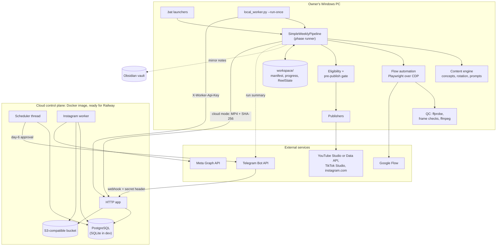
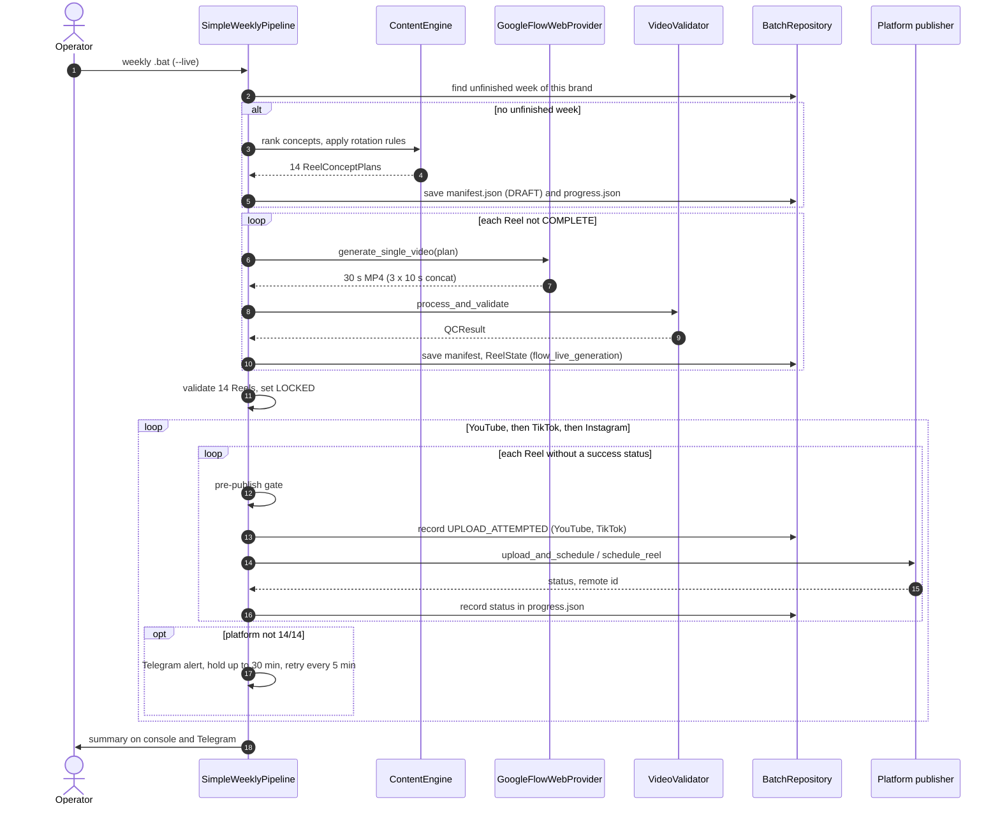
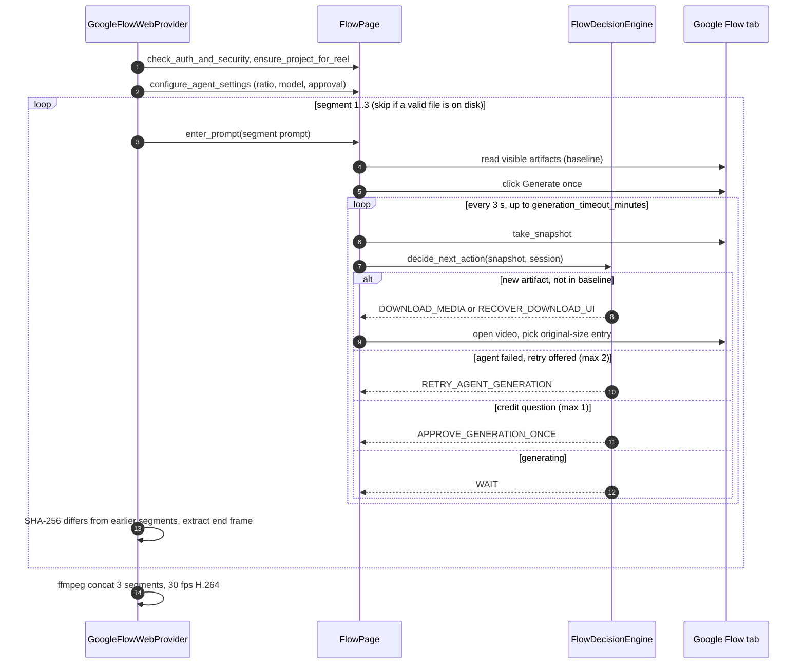
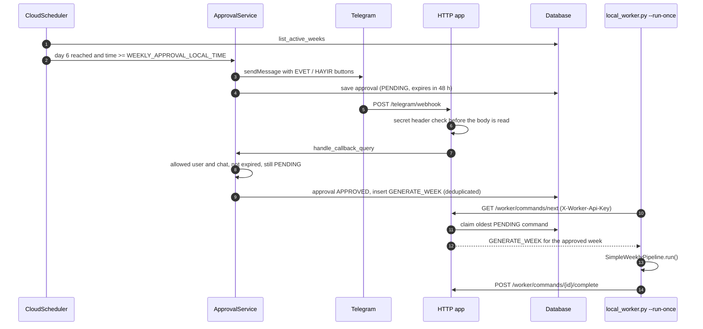
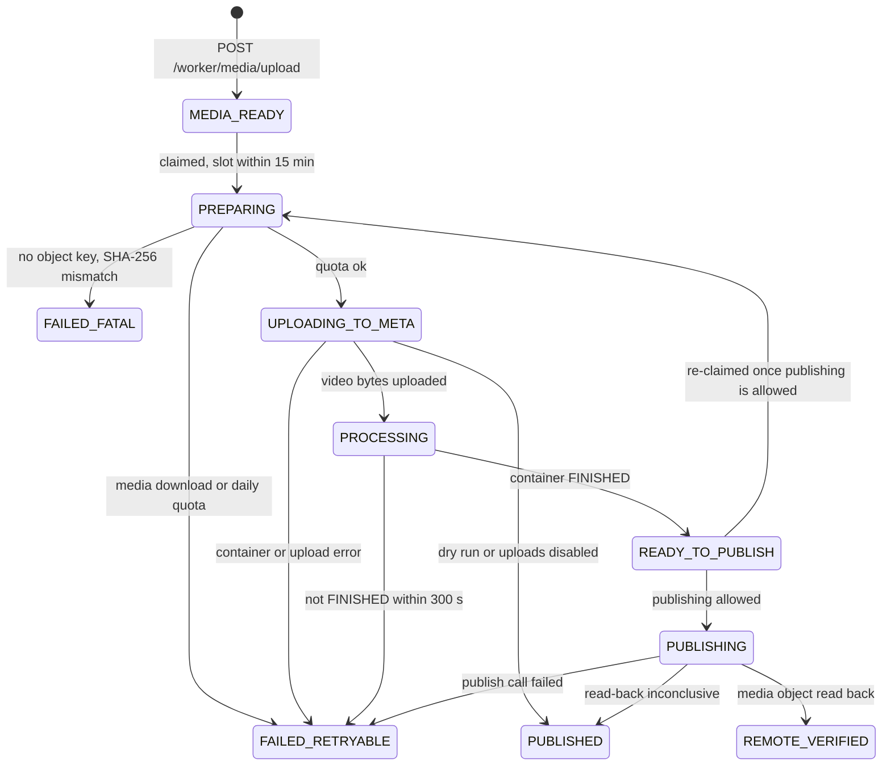

# How Reels AI Factory works

This document explains the engineering behind the repository: what each part does, how a week of Reels moves through the system, which rules decide what gets generated and published, and why the code is shaped the way it is. It is written for an engineer who has never seen the project. Every number below comes from the code or from a test run on this commit; file and symbol names are given so each claim can be checked.

**Contents:** [1. Scope](#1-what-it-is-and-what-it-is-not) · [2. Architecture](#2-architecture) · [3. Runtime flows](#3-runtime-flows) · [4. Data model](#4-data-model) · [5. Core logic](#5-core-logic-in-depth) · [6. Design decisions](#6-design-decisions-and-trade-offs) · [7. Testing](#7-testing-strategy) · [8. Limitations](#8-limitations-known-gaps-and-next-steps) · [9. Code tour](#9-code-tour) · [10. Glossary](#10-glossary) · [Türkçe özet](#türkçe-özet)

## 1. What it is and what it is not

**What it is.** A Python automation that produces a weekly series of 14 vertical 30-second videos per channel (7 days × 2 slots, 19:30 and 22:00 Europe/Istanbul) and schedules them on YouTube, TikTok and Instagram. It runs for two channels that belong to the owner, BuildVerse and Crafts By Man, each with its own accounts, browser profiles, ID prefix and content format ([`brands.py`](../automation/brands.py)).

One weekly run does five things in a fixed order:

1. **Plan** 14 concepts from curated concept libraries, using the channel's own history so a concept rests before it returns.
2. **Generate** each video in Google Flow (Google's web app for video generation) by driving a real Chrome session with Playwright: three 10-second segments per Reel, joined with FFmpeg.
3. **Check** every file (stream, aspect ratio, black/empty/frozen frames, audio policy) and lock the week's plan once all 14 pass.
4. **Schedule** each Reel through the platform's own scheduler (YouTube Studio or the YouTube Data API, TikTok Studio, the instagram.com composer), so nothing has to be online at publish time.
5. **Report** the outcome on the console, in an Obsidian vault mirror and on Telegram.

**What it is not.**

- Not a generative model. The prompts are assembled deterministically from hand-written concept libraries and templates ([`content/`](../automation/content)); the "agents" in [`agents/`](../automation/agents) are deterministic bookkeeping classes, not language models. Video generation happens inside Google Flow.
- Not a hosted or multi-tenant product. Brand accounts are hard-coded in [`brands.py`](../automation/brands.py), and generation needs the owner's Windows PC with signed-in Chrome profiles.
- Not an official API integration for TikTok or the Instagram composer. Those two (and YouTube in its default `studio` mode) are driven through their web UIs, which is why a large part of the code is UI observation and defensive checks.
- The cloud control plane ([`cloud/`](../automation/cloud)) is packaged with a `Dockerfile` and is ready for Railway ([`railway.toml`](../railway.toml)), but it is optional and is not currently deployed. Everything in the weekly pipeline works without it except the optional cloud Instagram route and Telegram approvals.

**Honest status of the entry points.** The repository contains three generations of orchestration:

| Entry point | Role today |
|---|---|
| [`simple_weekly_pipeline.py`](../automation/simple_weekly_pipeline.py) | The live weekly entry point, called by the weekly `.bat` launchers and by the cloud worker command. Most of this document is about it. |
| [`run.py`](../automation/run.py) and [`publish.py`](../automation/publish.py) | The older Obsidian-centric CLIs: generate N Reels as vault notes (`03_SCRIPTS → 05_READY`), then schedule `05_READY` notes. Still in the repository and covered by tests; the README's sample output comes from `run.py --dry-run`. |
| [`weekly_orchestrator.py`](../automation/weekly_orchestrator.py) | Marked legacy in its own docstring; kept for its tests, not used by any launcher. |

## 2. Architecture



| Component | Responsibility | Main code |
|---|---|---|
| Launchers | One-click Windows entry points: first-time install, Flow login, per-brand logins, the weekly run per brand, single-platform catch-up runs | [`*.bat`](../BUILDVERSE_HAFTALIK_14_REEL.bat) in the repo root |
| Brand registry | Per-channel identity: content mode, ID prefix, expected account handles, Chrome profiles and CDP ports, enabled platforms; refuses to publish for an unconfigured brand | [`brands.py`](../automation/brands.py) `Brand`, `ensure_publishable` |
| Weekly pipeline | Plans the week, runs the phases in order, persists every step, resumes where it stopped | [`simple_weekly_pipeline.py`](../automation/simple_weekly_pipeline.py) `SimpleWeeklyPipeline` |
| Content engine | Concept libraries, diversity scoring, per-mode providers, three-segment prompt construction | [`content/engine.py`](../automation/content/engine.py), [`content/prompt_engine.py`](../automation/content/prompt_engine.py), [`content/segment_planner.py`](../automation/content/segment_planner.py), [`content/story_planner.py`](../automation/content/story_planner.py), [`content/hidden_build_planner.py`](../automation/content/hidden_build_planner.py) |
| Content-mode registry | Single source of truth for each mode's audio policy and live eligibility | [`content/content_modes.py`](../automation/content/content_modes.py) |
| Flow automation | Connects to Chrome over CDP, one Flow project per Reel, a polling state machine per segment, safe download, concatenation | [`flow/generator.py`](../automation/flow/generator.py), [`flow/page.py`](../automation/flow/page.py), [`flow/state_machine.py`](../automation/flow/state_machine.py), [`flow/downloader.py`](../automation/flow/downloader.py) |
| Quality control | ffprobe inspection, frame sampling, audio policy, faststart remux, segment concatenation | [`quality/validator.py`](../automation/quality/validator.py), [`quality/frames.py`](../automation/quality/frames.py), [`quality/concatenator.py`](../automation/quality/concatenator.py) |
| Gates | Production provenance, Reel ID invariant, placeholder metadata, slot match, file hash | [`publishing/eligibility.py`](../automation/publishing/eligibility.py), [`publishing/preflight_gate.py`](../automation/publishing/preflight_gate.py) |
| Publishers | One per platform route, each reporting a platform status that the pipeline records | [`youtube_studio_publisher.py`](../automation/publishing/youtube_studio_publisher.py), [`youtube_publisher.py`](../automation/publishing/youtube_publisher.py), [`tiktok_publisher.py`](../automation/publishing/tiktok_publisher.py), [`instagram_web_publisher.py`](../automation/publishing/instagram_web_publisher.py) |
| Local state | Week manifest and progress files, per-Reel state, publish records | [`orchestration/batch_manifest.py`](../automation/orchestration/batch_manifest.py), [`orchestration/state_repository.py`](../automation/orchestration/state_repository.py), [`publishing/repository.py`](../automation/publishing/repository.py) |
| Obsidian | Mirror notes for the weekly pipeline; the vault is the primary store for the older `run.py` / `publish.py` path | [`orchestration/obsidian_mirror.py`](../automation/orchestration/obsidian_mirror.py), [`obsidian/reader.py`](../automation/obsidian/reader.py), [`obsidian/writer.py`](../automation/obsidian/writer.py) |
| Cloud control plane | Standard-library HTTP server: health, Telegram webhook, worker command queue, media upload; background scheduler for the day-6 approval and the Instagram worker | [`cloud/app.py`](../automation/cloud/app.py) and the rest of [`cloud/`](../automation/cloud) |
| Local worker | Heartbeat, claim one cloud command, run the weekly pipeline, report completion, mirror cloud state into the vault | [`local_worker.py`](../automation/local_worker.py), [`local_worker_cloud_client.py`](../automation/local_worker_cloud_client.py), [`media_handoff.py`](../automation/media_handoff.py) |

**The launchers.** The weekly `.bat` files call the pipeline module directly, with `--live` unless `--dry-run` is passed:

| Launcher | What it runs |
|---|---|
| `INSTALL_FIRST_TIME.bat` | Creates `.venv`, installs `requirements.txt` and Playwright Chromium, copies `config.example.json` to `config.local.json` |
| `FLOW_LOGIN.bat` | Starts Chrome with a dedicated profile and remote debugging on port 9222 ([`flow/chrome_launcher.py`](../automation/flow/chrome_launcher.py)) for a manual Google sign-in |
| `YOUTUBE_LOGIN.bat` | Interactive OAuth for the YouTube Data API mode (`publish.py --youtube-auth`) |
| `BUILDVERSE_GIRIS.bat`, `CRAFTSBYMAN_GIRIS.bat` | Open the brand's own Chrome profiles on the brand's ports for a manual sign-in ([`publishing/brand_login.py`](../automation/publishing/brand_login.py)) |
| `BUILDVERSE_HAFTALIK_14_REEL.bat` | Weekly run for BuildVerse; flags `--dry-run`, `--sessiz` (silent mode), `--ig-cloud` (cloud Instagram route) |
| `CRAFTSBYMAN_HAFTALIK_14_REEL.bat` | Weekly run for Crafts By Man; flags `--dry-run`, `--start-date` |
| `*_SADECE_YOUTUBE/TIKTOK/INSTAGRAM.bat` | One platform phase only (`--phase`), which skips the 30-minute hold; the Crafts By Man ones are pinned to `--week-id CBM-2026-W34` |
| `BASLAT.bat` | Older generic weekly launcher for the default brand |

There is no launcher for `local_worker.py`; it is started by hand (`python -m automation.local_worker --run-once`), and without `--run-once` it only sends one heartbeat.

## 3. Runtime flows

### 3.1 One weekly run



`SimpleWeeklyPipeline.run` ([source](../automation/simple_weekly_pipeline.py)) is a cascade: GENERATE runs only if some Reel is not `COMPLETE`, VALIDATE+LOCK only if the manifest is not `LOCKED`, and each platform only if it is enabled for the brand and not already 14/14. Every phase reads its own progress from disk, so re-running the same `.bat` after any failure continues where the previous run stopped and never regenerates a finished video or re-uploads a scheduled one. A `--phase` run executes one handler once and returns.

### 3.2 Generating one Reel in Google Flow



The provider ([`flow/generator.py`](../automation/flow/generator.py) `GoogleFlowWebProvider.generate_single_video`) attaches to an already running Chrome over the DevTools protocol instead of launching an automated browser, so the Google session is the owner's own. A sign-in page, a CAPTCHA pattern or Flow's logged-out landing page raises `UserActionRequiredError` ([`flow/page.py`](../automation/flow/page.py) `FlowPage.check_auth_and_security`); the code never tries to get past them. The decision logic is described in [5.4](#54-the-flow-generation-state-machine).

### 3.3 Optional cloud start: Telegram approval to worker command



The scheduler thread wakes every 30 seconds ([`cloud/app.py`](../automation/cloud/app.py) `CloudApp._scheduler_loop`) and only does work when `ENABLE_WEEKLY_SCHEDULER` or `ENABLE_INSTAGRAM_WORKER` is true; both default to false. "Day 6" is `start_date + 5 days` of a week row in `cloud_weeks` ([`cloud/scheduler.py`](../automation/cloud/scheduler.py) `CloudScheduler.check_day6_approvals`). The worker reports `COMPLETE` when the pipeline returns success and `FAILED_RETRYABLE` with the last phase message otherwise ([`local_worker.py`](../automation/local_worker.py) `LocalWorker.process_next_command`).

### 3.4 Optional cloud Instagram route

With `--instagram-delivery cloud` (`--ig-cloud` on the BuildVerse launcher), the Instagram phase does not open instagram.com. For each Reel it uploads the MP4 as a multipart form, with its SHA-256 as a field, to `POST /worker/media/upload` ([`media_handoff.py`](../automation/media_handoff.py) `handoff_reel_to_cloud`); the server verifies the hash, stores the file under `media/<week_id>/<reel_id>/<sha256>.mp4` and records an Instagram job as `MEDIA_READY` ([`cloud/local_worker_api.py`](../automation/cloud/local_worker_api.py) `handle_media_upload`). The local side records `MEDIA_READY` and moves on. The cloud Instagram worker later publishes the job through the Meta Graph API:



The worker ([`cloud/instagram_worker.py`](../automation/cloud/instagram_worker.py) `InstagramCloudWorker.execute_job`) re-downloads the object, re-checks its SHA-256, checks the 24-hour publishing quota, creates a Reels container with `is_ai_generated`, uploads the bytes with the resumable upload, polls the container for up to 300 seconds, publishes and reads the media object back. Any unexpected exception ends in `FAILED_FATAL`. Because the Graph API has no scheduled-publish parameter, the post goes live when the job runs, not through a platform scheduler; see [8](#8-limitations-known-gaps-and-next-steps) for what that means for timing.

## 4. Data model

All local state is JSON or Markdown under the working directory, written atomically (temporary file, then `replace`). Nothing in `workspace/`, `13_PUBLISHING/` or `secrets/` is committed (`.gitignore`).

**Week manifest** — `workspace/batches/<week_id>/manifest.json`, [`BatchManifest`](../automation/orchestration/batch_manifest.py) and `BatchReel`. The content plan; immutable once `status` is `LOCKED`.

| Field | Meaning |
|---|---|
| `week_id` | ISO week of the start date with the brand prefix, e.g. `2026-W40` or `CBM-2026-W40` |
| `start_date`, `timezone`, `target_reels` | First day, `Europe/Istanbul`, 14 |
| `status` | `DRAFT` or `LOCKED`; publishing phases refuse anything but `LOCKED` |
| `content_mode` | Mode the week was planned in; a resumed week keeps it even if another `--content-mode` is passed |
| `reels[].reel_id`, `index`, `scheduled_at_local`, `scheduled_at_utc` | One Reel per slot |
| `reels[].title`, `caption`, `hashtags` | Publishing metadata decided at plan time |
| `reels[].concept_id_slug`, `environment`, `architecture`, `transformation`, `camera_style`, `lighting`, `materials`, `reveal`, `diversity_score` | The raw selector fields, stored so the exact same prompt can be rebuilt in a later process (`_rebuild_concept_plan`) |
| `reels[].generation_status`, `generation_error`, `video_path`, `video_sha256` | GENERATE outcome per Reel |

**Week progress** — `workspace/batches/<week_id>/progress.json`, mutable and separate from the manifest so a platform failure can never touch the content plan. Per Reel and platform: `status`, `remote_id` (YouTube/TikTok) or `remote_media_id` (Instagram), `url`, `error`, and a `dry_run` stamp written by `_record_platform_status`.

**Reel state** — `workspace/state/reels/<reel_id>.json`, [`ReelState`](../automation/orchestration/models.py). The provenance record the gates trust: `source` (only `flow_live_generation` is live-eligible; `mock_test_provider`, `diagnostic_test`, `legacy_unverified`, `quarantined` are not), `pipeline_version`, `content_mode`, `generation_status`, `qc_status`, `video_path`, `video_sha256`, `quarantine_reason`, plus metadata and schedule. The weekly pipeline writes it once, when a Reel passes QC.

**Publish record** — `13_PUBLISHING/PUB-<reel_id>-<PLATFORM>.md` in the working directory, [`PublishRecord`](../automation/publishing/models.py) via [`PublishingRepository`](../automation/publishing/repository.py). Written by the YouTube Studio publisher as resume evidence: `status`, `remote_id`, `remote_url`, `upload_started`, `remote_draft_exists`, `last_error`, the verified schedule date and time. `merge_with_existing` lets existing remote evidence win over a fresh record.

**Brand** — [`Brand`](../automation/brands.py): `brand_id`, `content_mode`, `alternate_content_mode`, `id_prefix`, expected YouTube handle and channel id, expected TikTok username, CDP ports, profile suffix, `instagram_delivery`, `platforms`.

**Cloud database** — six tables created by [`Database.init_db`](../automation/cloud/database.py) (PostgreSQL in production, SQLite in development; `?` placeholders are translated to `%s` for PostgreSQL):

| Table | Key fields |
|---|---|
| `cloud_weeks` | `week_id`, `start_date`, `end_date`, `status`, `approval_status`, `approval_sent_at`, `approved_at`, `rejected_at` |
| `telegram_approvals` | `approval_id`, `week_id`, `next_week_id`, `status` (PENDING, APPROVED, REJECTED, EXPIRED), `telegram_message_id`, `expires_at` |
| `local_worker_commands` | `command_id`, `type` (e.g. `GENERATE_WEEK`), `week_id`, `status`, `claimed_by`, `claimed_at`, `completed_at`, `last_error` |
| `instagram_scheduled_jobs` | `job_id`, `week_id`, `reel_id`, `scheduled_at_local`, `media_object_key`, `media_sha256`, `caption`, `status`, `lease_expires_at`, `container_id`, `remote_media_id`, `permalink` |
| `worker_heartbeats` | `worker_id`, `hostname_hash`, `version`, `capabilities_json`, `last_seen_at` |
| `notification_logs` | `notification_id`, `notification_type`, `recipient`, `payload_hash`, `sent_at` |

## 5. Core logic in depth

### 5.1 Calendar, week IDs and Reel IDs

- **Slots.** `DAILY_SLOT_TIMES = ("19:30", "22:00")`; [`generate_14_slot_week_plan`](../automation/orchestration/slot_generator.py) produces 7 days × 2 slots in Europe/Istanbul and stores each slot in local and UTC form, so month and year boundaries need no special case.
- **Start date** ([`SimpleWeeklyPipeline._resolve_start_date`](../automation/simple_weekly_pipeline.py)). The new week starts the day after the latest slot that actually reached a platform (a success status in `progress.json`, across all of the brand's weeks), but never earlier than the earliest usable day. Today is usable only if its first slot is at least `SAME_DAY_START_LEAD_HOURS = 6` hours away; otherwise the week starts tomorrow. A brand that has never published starts at the earliest usable day. `--start-date` overrides all of this.
- **Resume first.** With no `--week-id`, `_find_unfinished_week_id` picks the most recent week of this brand that is not finished (not locked, not fully generated, or some enabled platform below 14/14). This is what makes "run the same `.bat` again" safe: it never opens a new week (and spends new Flow credits) while an old one is in flight.
- **Week ID.** `brand.week_id(ISO week of start date)`, e.g. `CBM-2026-W40`. Brands are isolated by prefix: `Brand.owns_week_id` makes the default (unprefixed) brand reject every week that carries another brand's prefix.
- **Reel IDs** ([`_allocate_reel_ids`](../automation/simple_weekly_pipeline.py)). Monotonic and never reused: every ID found in any manifest, any `ReelState` file or any `*REEL-*.mp4` in `workspace/downloads` is taken, as are `HARD_EXCLUDED_REEL_IDS` (`REEL-2026-0010`, the diagnostic Reel, and `REEL-2026-0001`, a test video that once reached YouTube). The default brand starts its search at 11, a prefixed brand at 1.

### 5.2 Choosing 14 concepts

Concepts live in four hand-curated libraries, one per content mode. Pool sizes at this commit: 40 construction concepts in 10 groups ([`concepts.py`](../automation/content/concepts.py)), 33 real-history places in 7 groups ([`story_concepts.py`](../automation/content/story_concepts.py)), 28 buried-object builds in 3 groups ([`hidden_build_concepts.py`](../automation/content/hidden_build_concepts.py)) and 16 cross-section subjects in 3 groups ([`cutaway_concepts.py`](../automation/content/cutaway_concepts.py)).

**Diversity score** ([`diversity.py`](../automation/content/diversity.py) `calculate_diversity_score`). For each candidate (a concept with one of its first two environments and first two architectures):

```
novelty   = 1 − max similarity to any past record
            similarity = Jaccard overlap of normalised word sets
            (lower-case, words ≤ 2 letters and a small stop-word list removed);
            a past topic_key equal to the concept slug, or contained in / containing
            the candidate key, counts as 0.95
penalty   = max over the 5 most recent categories that match this concept
            of 0.5 / (position + 1)
score     = 0.50 × novelty + 0.30 × 0.92 − 0.35 × penalty
```

Candidates with `novelty < 0.40` are dropped, the rest sorted by score, and one plan per concept slug is kept ([`TemplateContentProvider.generate_plans`](../automation/content/engine.py)). The story, hidden-build and cutaway providers then round-robin across category groups (`StoryContentProvider._interleave_by_group`), because selection order is publishing order and the libraries are grouped by theme. With an empty history the score is `0.5 + 0.276 = 0.776`, which is the 0.78 printed in the README's sample dry run.

**Rotation rule** ([`SimpleWeeklyPipeline._fresh_plans`](../automation/simple_weekly_pipeline.py)). The engine's score turned out to be a weak signal for the weekly pipeline (its comments record a week that repeated eleven of the fourteen concepts from two weeks earlier), so the order is driven by the channel's own history instead:

1. `last_aired` maps each concept slug to the latest date the brand scheduled it, read from every manifest the brand owns (`_concept_last_aired`).
2. Candidates (`max(count × 4, 40)` ranked plans) are sorted by days rested, longest first; a never-aired concept counts as 10,000 days. The engine's ranking is only the tie-break. The sorted candidates are then interleaved across category groups, so putting never-aired concepts first cannot open a week with several concepts of one group in a row.
3. The required rest adapts to the pool: `quarantine = min(21, (pool // per_week − 1) × 7)` days (`_quarantine_days`, ceiling `CONCEPT_QUARANTINE_DAYS = 21`). For BuildVerse's 7 story + 7 cutaway slots that is 21 days for stories (33 // 7 = 4 weeks) and 7 days for cutaways (16 // 7 = 2); for Crafts By Man's 14 hidden-build slots it is 7 days (28 // 14 = 2).
4. If not enough concepts have rested that long, the longest-rested of the rest fill the week and a warning names the shortest gap.
5. Finally `_refuse_a_repeat_within_days` raises `CONCEPT_POOL_EXHAUSTED` before anything is saved if any chosen concept aired less than `CONCEPT_MIN_GAP_DAYS = 7` days before the week starts.

**Two formats in one week** (`_plan_concepts`). A brand with an `alternate_content_mode` gets 7 plans from each library, interleaved so the 19:30 slot carries the primary mode and the 22:00 slot the alternate. BuildVerse uses `narrative_ambient_story` at 19:30 and `cutaway_reveal_story` at 22:00; Crafts By Man is single-format (`hidden_build_story`).

### 5.3 From concept to prompts

Every mode produces the same `ReelConceptPlan` shape ([`prompt_engine.py`](../automation/content/prompt_engine.py)): three `SegmentPlan`s of 10 seconds each, so the generator, concatenator and manifest need no per-mode branches.

- **Continuity contract.** A `ContinuityContext` (environment, terrain, architecture style, structure identity, materials, scale, camera direction and height, lighting, time of day, palette) is rendered into every segment's prompt as "Preserve exactly: …", because Flow renders each segment separately and would otherwise drift ([`segment_planner.py`](../automation/content/segment_planner.py) `ContinuityContext.to_prompt_clause`).
- **Three beats.** Construction Reels use `FOUNDATION → MAIN_CONSTRUCTION → DETAILS_AND_REVEAL`, with explicit "do not restart from empty land / do not jump to the finished result" lines and a final segment that spends roughly 6–7 seconds on details and the last 3 on the reveal. History stories use `BEFORE → THE_TURN → WHAT_REMAINS`; cutaways use `PLAIN_SURFACE → THE_CUT → THE_WORKING_INTERIOR`, because Flow reads beat names and "what remains" would push it towards decay ([`story_planner.py`](../automation/content/story_planner.py)). Hidden-build Reels reuse the story beat names and repeat one fixed description of the recurring craftsman in every beat so his face stays consistent ([`hidden_build_planner.py`](../automation/content/hidden_build_planner.py) `HiddenBuildPlanner.CRAFTSMAN`).
- **Negative exclusions.** Each planner appends its own exclusion list. All of them ban captions, written text, logos and watermarks; the story-type lists also ban narration, dialogue and intelligible speech and ask for diegetic ambience only (`StoryPlanner.AUDIO_DIRECTION`), so audio modes still have no voiceover.
- **Duration sanitiser.** `sanitize_video_duration` ([`duration_rules.py`](../automation/content/duration_rules.py)) rewrites any "N-second" phrase to the segment length, which must be one of the durations the code allows for the configured Flow video model (4, 6, 8 or 10 s, otherwise 10), and appends the 9:16 and duration line if missing.
- Each segment prompt carries `prompt_hash` (first 16 hex characters of its SHA-256), used to tie a Flow session to the prompt that produced it.

### 5.4 The Flow generation state machine

Generation costs Flow credits, so the browser layer is built around not paying twice and not downloading the wrong file.

- **One Flow project per Reel** (`FlowPage.ensure_project_for_reel`), with project settings (ratio, outputs, model, approval mode, duration) configured once per Reel.
- **Resume from disk.** A segment file over 10,000 bytes already in `workspace/segments/<reel_id>/` is reused, unless its SHA-256 equals an earlier segment's, in which case it is deleted and regenerated ([`GoogleFlowWebProvider.generate_single_video`](../automation/flow/generator.py)).
- **Baseline fingerprints.** Before clicking Generate, `FlowPage.trigger_generation` records the fingerprints of every artifact already on screen. A second click in the same session raises `GenerationStateUncertain` (double-click guard).
- **Decision table** ([`flow/state_machine.py`](../automation/flow/state_machine.py) `FlowDecisionEngine.decide_next_action`), evaluated every 3 seconds until `generation_timeout_minutes` (20 by default), in priority order:

| Condition on the snapshot | Action |
|---|---|
| Prompt not yet submitted in this session | `START_MEDIA_GENERATION` (never download a stale artifact) |
| Download button visible and a new artifact (or already generating) | `DOWNLOAD_MEDIA` |
| New artifact and no stop button | `RECOVER_DOWNLOAD_UI` (open the video detail view) |
| Agent says media is ready, no stop button | `RECOVER_DOWNLOAD_UI` |
| Agent failed and Flow offers a retry | `RETRY_AGENT_GENERATION`, at most `MAX_AGENT_RETRIES_PER_SEGMENT = 2`, then `USER_ACTION_REQUIRED` |
| Flow asks to approve this generation's credits | `APPROVE_GENERATION_ONCE`, at most `MAX_GENERATION_APPROVALS_PER_SEGMENT = 1`; only the single-shot "Onayla" is clicked, never "Her zaman onayla" |
| Stop button visible or a progress message | `WAIT` |
| Agent asks about duration | Answer once with the segment length, then only wait |
| Agent error | `USER_ACTION_REQUIRED` |

- **Download guard.** Even with an enabled download button, the file is fetched only if the artifact's fingerprint is new for this session ([`FlowPage.wait_for_completion_and_download`](../automation/flow/page.py)). Flow's download control opens a quality menu; [`_choose_original_quality`](../automation/flow/downloader.py) clicks only the original-size entry and refuses any label matching the paid pattern (`yükseltilmiş`, `upscal`, or `N kredi/credit`), because the upscaled entries spend extra credits. An unrecognised menu is dumped to `screenshots/errors/` and the Reel fails with `DOWNLOAD_QUALITY_MENU_UNRECOGNISED` instead of guessing.
- **Duplicate guard.** After download, a segment whose SHA-256 matches an earlier segment raises `SEGMENT_DUPLICATE`; an end frame is extracted for reference; the three segments are concatenated.

### 5.5 Quality gates

QC runs once per Reel on the concatenated file ([`VideoValidator.process_and_validate`](../automation/quality/validator.py)). Each check rejects with a reason that is stored as `generation_error`:

| Check | Rule | Rejects |
|---|---|---|
| File | exists and is not empty | missing or 0-byte downloads |
| Stream ([`ffprobe.py`](../automation/quality/ffprobe.py) `inspect_video`) | a video stream and duration > 0.5 s | audio-only or broken files |
| Aspect ratio | width / height between 0.50 and 0.60 (9:16 = 0.5625) | landscape or square renders |
| Frames ([`frames.py`](../automation/quality/frames.py) `extract_and_analyze_frames`) | 5 grayscale frames at 0 %, 25 %, 50 %, 75 % and the end; mean brightness < 5 is black, standard deviation < 4 is empty, mean absolute difference between first and last frame < 3 is frozen | black, blank or static videos |
| Audio policy | modes with `AUDIO_REQUIRED` must have an audio stream (`AUDIO_MISSING`) | a story Reel that came back silent |
| Post-processing | `ffmpeg -c:v copy`, AAC 192 kbit/s 48 kHz kept for audio modes or `-an` for silent mode, `-movflags +faststart` | (not a check: the output file) |

Concatenation ([`concatenator.py`](../automation/quality/concatenator.py) `VideoConcatenator.concatenate_segments`) re-encodes with the concat demuxer to H.264, `yuv420p`, 30 fps, keeping audio only when the mode requires it, and falls back to a `filter_complex` concat if the output is missing or under 10,000 bytes. The frame checks use FFmpeg for extraction and Pillow plus NumPy for the statistics.

The audio decision itself lives in one place, [`content_modes.py`](../automation/content/content_modes.py): `silent_global_step_by_step` is `AUDIO_FORBIDDEN`; `narrative_ambient_story`, `hidden_build_story` and `cutaway_reveal_story` are `AUDIO_REQUIRED`. An unknown mode is not live-eligible and its policy is `AUDIO_FORBIDDEN` (fail closed).

**Circuit breaker.** If two Reels in a row fail with the same signature (the first two colon-separated parts of the error, e.g. `QC_FAILED: AUDIO_MISSING`), GENERATE stops (`MAX_CONSECUTIVE_SAME_FAILURES = 2`) instead of spending credits on the remaining Reels; the batch stays resumable.

### 5.6 Validate, lock and the pre-publish gate

`_run_validate_and_lock_phase` locks the manifest only if there are exactly 14 unique Reel IDs, no two Reels share a slot, and, for each Reel, the video path and hash are recorded, the file exists, [`is_live_production_eligible`](../automation/publishing/eligibility.py) passes, the Reel ID invariant holds and the metadata is not a placeholder. In a dry run only the placeholder check applies, because mock media is ineligible by design.

`is_live_production_eligible` (fail closed: no `ReelState` means ineligible) requires: the ID is not hard-excluded, no quarantine reason, `source == "flow_live_generation"`, `pipeline_version == 3`, a registered live-eligible mode, `generation_status == "COMPLETE"`, `qc_status == "PASS"`, a non-empty file whose SHA-256 matches the state, a resolution that is not the mock provider's 540×960, and an audio stream that matches the mode.

[`run_pre_publish_hard_gate`](../automation/publishing/preflight_gate.py) runs before every single upload and adds: the platform has not already succeeded for this Reel; slot ID, state ID, publish-record ID and the ID inside the file name are identical (`verify_reel_id_invariant`, otherwise `REEL_ID_MEDIA_MISMATCH`); the title/caption is not the known placeholder (`is_placeholder_metadata`); the record's schedule equals the slot's; and the record's SHA-256 matches the file.

### 5.7 Platform phases

`_run_platform_phase` (YouTube and TikTok) and `_run_instagram_web_phase` / `_run_instagram_cloud_phase` share these rules:

- **Status classes.** Success: `SCHEDULED`, `PUBLISHED`, `REMOTE_VERIFIED`. Soft failure (the submit happened but the read-back was inconclusive; record it and continue with the next Reel): `SCHEDULE_RESUME_REQUIRED`, `UPLOADED_DRAFT`, `REVIEW_REQUIRED`. A later pass (the hold or a rerun) calls the publisher again for these Reels; the Studio publisher then verifies and resumes instead of uploading. Anything else stops the platform for this run. Instagram also treats `MEDIA_READY` and `SUBMITTED_UNVERIFIED` as terminal, so neither route can deliver a Reel the other already delivered.
- **Write before acting.** For a live YouTube or TikTok upload, `UPLOAD_ATTEMPTED` is written to `progress.json` before the publisher is called. A rebuilt `PublishRecord` carries `upload_started=True` for any status in `UPLOAD_ALREADY_ATTEMPTED_STATUSES`, which tells the Studio publisher to resume a draft instead of uploading again.
- **Remote ID collision guard.** A returned remote ID that any other Reel of the same brand (in any week) already holds is rejected as `REEL_ID_MEDIA_MISMATCH` and not recorded. TikTok's fixed marker `tiktok_scheduled_post` is exempt (`NON_IDENTIFYING_REMOTE_IDS`) because TikTok returns no per-post ID.
- **Divergence report.** `_report_state_divergence` logs `[STATE_DIVERGENCE]` when `progress.json` and the `13_PUBLISHING` record disagree on a remote ID, without choosing a winner.
- **Hold for a manual fix.** If a platform ends below 14/14, `_hold_for_manual_fix` sends a Telegram alert (when a bot token and chat ID are configured) and retries the phase every 5 minutes for up to 30 minutes (`stuck_retry_seconds = 300`, `stuck_wait_minutes = 30`), then moves on to the next platform.
- **Dry runs cannot poison live state.** Records written in a dry run carry `dry_run: true` and are never counted as done by a live run (`_counts_as_done`); a dry run against a week that already has non-mock remote IDs is refused with `DRY_RUN_OVER_LIVE_WEEK`.
- **Brand checks.** In a live run the YouTube, TikTok and Instagram-web phases call `Brand.ensure_publishable` first (`BRAND_NOT_CONFIGURED` for placeholder accounts), and a `--phase` for a platform the brand does not publish to raises `PLATFORM_DISABLED_FOR_BRAND`.

### 5.8 What each publisher does

- **YouTube Studio** ([`YouTubeStudioPublisher.upload_and_schedule`](../automation/publishing/youtube_studio_publisher.py), default `youtube_mode = "studio"`). Navigates to the expected channel's Studio URL and treats the channel ID surviving in the URL as proof of the account, otherwise reads the channel header (`ACCOUNT_MISMATCH` on a different channel). With remote evidence it first checks whether the video is already scheduled for this date and time and, if so, records success without touching it; it resumes an existing draft rather than uploading; a recorded ID whose editor no longer opens and which is not scheduled is cleared (`STALE_REMOTE_ID_CLEARED`) so the file is uploaded once more. A fresh upload captures the video ID, writes title, description and hashtags (an unverified title stops the Reel instead of publishing under the file name), walks the wizard (audience, AI disclosure), opens the schedule card, sets date and time and reads them back, submits, and verifies the scheduled state in the content list with back-offs of 10, 20 and 30 seconds. Without a video ID it verifies by title and date.
- **YouTube Data API** ([`YouTubePublisher`](../automation/publishing/youtube_publisher.py), `youtube_mode = "api"`). OAuth token per brand (`secrets/youtube/token<suffix>.json`), authenticated-channel check, `videos.insert` with `privacyStatus` (default `private`), `publishAt`, `selfDeclaredMadeForKids` and `containsSyntheticMedia`, resumable 5 MB chunks, then a `videos.list` read-back. Story and cutaway Reels also get localized titles and descriptions in `tr`, `hi`, `id` and `ja` ([`localizations.py`](../automation/publishing/localizations.py)); this happens only in API mode.
- **TikTok Studio** ([`TikTokPublisher.upload_and_schedule`](../automation/publishing/tiktok_publisher.py)). Account check by username, dismisses a leftover unsaved-draft banner, reuses an editor already open for this Reel instead of uploading again, replaces the default caption with caption plus hashtags, enables the AI-content label, selects "Planla" (schedule) and verifies it, sets the date and time and re-reads the live controls before submitting. The final click refuses to run unless schedule mode is verified and the time picker is closed ([`tiktok_ui_observer.py`](../automation/publishing/tiktok_ui_observer.py) `click_schedule_and_verify`). A secondary content-list check that comes back inconclusive is logged, and the Reel is still recorded as scheduled because the submit was confirmed.
- **Instagram web** ([`InstagramWebPublisher.schedule_reel`](../automation/publishing/instagram_web_publisher.py)). Refuses a slot less than 20 minutes away (`MIN_LEAD_MINUTES`), opens `instagram.com/scheduled_content/`, waits up to 45 seconds for the composer entry point, then runs open composer → upload → caption → AI label → schedule toggle → date → time → read date and time back → "Planla". Every step must succeed or the half-filled composer is abandoned. A confirmation that times out after the click becomes `SUBMITTED_UNVERIFIED`, which is never retried (a retry would post a second copy). A share-now wording on the final control aborts with `PUBLISH_NOW_BUTTON_REFUSED`.

All browser publishers follow the repository's browser rule ("Kural 31"): at most two semantic selector strategies per action, no forced or JavaScript clicks, and `NEEDS_USER_HTML` with a saved DOM snapshot instead of guessing when the UI changed. None of them deletes remote content; the only remote edits are finishing the Reel's own upload or draft.

### 5.9 The cloud control plane

**Request handling** ([`cloud/app.py`](../automation/cloud/app.py)). A standard-library `HTTPServer` (one request at a time, 60-second socket timeout) with these routes: `GET /` and `/health`, `POST /telegram/webhook`, `POST /worker/heartbeat`, `GET /worker/commands/next`, `POST /worker/commands/{id}/complete`, `GET /worker/state/sync`, `POST /worker/storage/self-test`, `POST /worker/media/upload`, `POST /worker/media/diagnostic-cleanup`. For every POST, `CloudApp.check_post_headers` runs before the body is read: `/worker/*` needs the worker key, the webhook needs its secret header (whenever a secret is configured, and always in production), any other path gets 404. Then: negative `Content-Length` → 400; multipart upload to `/worker/media/upload` → streamed to a temp file in 64 KB chunks with an incremental SHA-256 and a 100 MB cap (413); other bodies over 10 MB → 413; client JSON keys starting with `__` are stripped (they are reserved for server metadata such as the streamed file's path, which `_trusted_stream_path` additionally confines to the stream temp directory); a non-object JSON body → 400; unexpected exceptions → a generic 500 with the traceback only in the server log.

**Approval state machine** ([`cloud/approval_service.py`](../automation/cloud/approval_service.py)). An approval is created once per week (an existing pending one is reused) and expires after 48 hours. A callback is processed in this order: allowed user, allowed chat, parse `weekly_approve:<id>` / `weekly_reject:<id>`, approval exists, not expired, still `PENDING` (otherwise `ALREADY_PROCESSED`). Approval inserts a `GENERATE_WEEK` command; `Database.create_command` skips it if a command of the same type and week is already `PENDING`, `CLAIMED` or `RUNNING`, and `claim_command` only updates rows still `PENDING`, so two pollers cannot claim the same command.

**Health** ([`cloud/health.py`](../automation/cloud/health.py)). `/health` reports sanitized flags only: database connectivity, storage configured, scheduler and Instagram-worker switches, the three Instagram safety flags, whether Telegram is configured, and whether a worker heartbeat arrived in the last 180 seconds.

**Instagram safety flags.** `INSTAGRAM_DRY_RUN` (default true), `INSTAGRAM_ALLOW_UPLOAD` and `INSTAGRAM_ALLOW_PUBLISH` (default false). The Graph API client only transfers bytes when `dry_run` is false and upload is allowed, and only publishes when `dry_run` is false and publish is allowed ([`instagram_api.py`](../automation/publishing/instagram_api.py)). A job claimed while publishing is disabled stops at `READY_TO_PUBLISH`, and `claim_due_instagram_job` does not claim it again until publishing is enabled.

### 5.10 Security model

| Concern | Mechanism | Fails closed because |
|---|---|---|
| Worker endpoints | `X-Worker-Api-Key` compared with `hmac.compare_digest` ([`security.py`](../automation/cloud/security.py) `verify_worker_api_key`) | An empty key or a value copied from a template (`change-me`, `reels_ai_local_worker_key_dev`) disables the endpoints entirely (`CloudConfig.is_worker_api_enabled`) |
| Telegram webhook | `X-Telegram-Bot-Api-Secret-Token`, constant-time compare ([`telegram_webhook.py`](../automation/cloud/telegram_webhook.py) `check_webhook_headers`) | In production a missing secret rejects every call (403); `ENABLE_TELEGRAM_WEBHOOK=false` returns 503 |
| Who may approve | `verify_telegram_user` and `verify_telegram_chat` | No built-in IDs: with `TELEGRAM_ALLOWED_USER_ID` or `TELEGRAM_CHAT_ID` unset, every button press is refused and logged |
| Resource abuse | Header checks before any body read; 10 MB JSON cap; 100 MB streamed upload cap; 60-second socket timeout | A client without the worker key cannot make the server read a body or store a file; webhook bodies are read only after the secret check |
| Upload integrity | Client SHA-256 must equal the server's streamed hash; strict regexes for week, Reel and job IDs; `.mp4` only; an upload for a job that is already being processed or published, or a different file for an existing job, returns 409 | A mismatched or replayed upload never becomes a job |
| Production config | `APP_ENV=production` makes `Database` refuse a non-PostgreSQL URL; `railway_production_preflight` checks 17 items read-only, including template account values and a secret scan | A production container with SQLite fails at start-up instead of running on a throwaway database; the preflight lists every missing item before a deploy |
| Secrets in the repo | Environment variables or git-ignored files (`.env`, `secrets/`, `config.local.json`); `python -m automation.cloud.secret_scan` looks for Telegram, Meta, PostgreSQL-URL and S3 key patterns | — |
| Wrong channel | Per-brand account expectations, `ensure_publishable`, account checks in the YouTube and TikTok publishers (the Instagram web route has none, see [8](#8-limitations-known-gaps-and-next-steps)) | A placeholder or mismatched account stops before upload |
| Irreversible actions | Never clicks a share-now control, never deletes remote content, `SUBMITTED_UNVERIFIED` is never retried | A doubt ends in a stop and a human check, not a second post |

## 6. Design decisions and trade-offs

- **Drive the web UIs and use native schedulers.** Generation goes through Google Flow's web app, and scheduling goes through each platform's own scheduler in its web UI. The Instagram composer route was added because, as its module docstring notes, the Graph API path can only publish at the moment itself and shows nothing in the account's scheduled queue. Native schedulers mean the PC does not need to be on at publish time. The cost is fragility: UI changes break selectors. The code answers that with patient waits (many timeouts in the code comments were raised after a page that was merely slow was reported as broken), read-back of the values it sets (dates, times, titles, schedule mode), error snapshots under `screenshots/errors/`, and HTML fixtures of real controls in the tests. The YouTube Data API mode exists because a locale-dependent date picker put Reels on the wrong day; it trades UI fragility for API quota.
- **Attach to a real Chrome over CDP.** The owner signs in once by hand, and the automation reuses that session. Logins and CAPTCHAs are never automated; they stop the run with `USER_ACTION_REQUIRED`.
- **Immutable plan, mutable progress.** `manifest.json` freezes what will be published once it is locked; `progress.json` records what happened. A platform failure can only touch progress, and a rerun always rebuilds the same prompt from the stored selector fields.
- **Sequential, one platform at a time.** The pipeline processes one Reel at a time and one platform at a time, and holds a stuck platform for a manual fix. This is slower than parallel uploads but each failure is isolated and easy to reason about; the operator deals with one broken platform at a time.
- **Provenance over file names.** A file called `clean_REEL-….mp4` proves nothing. Only a persisted `ReelState` with `flow_live_generation` makes a video publishable, and absence of state means ineligible. This came from a real incident in which a mock test video reached YouTube.
- **Record the attempt, not just the result.** Writing `UPLOAD_ATTEMPTED` before an upload, keeping `upload_started` on rebuilt records and treating `SUBMITTED_UNVERIFIED` as terminal all prefer a missing post (visible, fixable by hand) over a duplicate post (which this system may not delete).
- **Fail closed on configuration.** Unknown content modes are not live-eligible and are treated as silent; unconfigured brands cannot publish; empty or template worker keys close the worker API; unset Telegram IDs refuse approvals; production refuses SQLite.
- **Adaptive rotation instead of a fixed blacklist.** A fixed 21-day rest would leave the 16-concept cutaway pool with nothing to publish; `_quarantine_days` scales the rest to the pool, and the hard 7-day floor turns an exhausted pool into an explicit error.
- **Standard-library HTTP server.** The cloud app has no web framework, which keeps the Docker image small (five pip packages) and the attack surface easy to read. It serves one request at a time, which is enough for one worker and one bot but not more.
- **Obsidian as a mirror, not the source of truth.** The weekly pipeline writes notes for humans but decides from JSON state; a failure while mirroring is logged and ignored. (The older `run.py` / `publish.py` path used the vault as its database, which is why both layouts exist.)

## 7. Testing strategy

Run on this commit (git archive of `7d99aff`) with Python 3.11.15, FFmpeg 6.1.1 and the packages from `requirements.txt`:

```
python -m pytest -q -rs tests/
1051 passed, 3 skipped in 340.18s (0:05:40)
```

That is 1,054 collected tests in 64 files. The three skips are checks of the production PC itself (an installed `chrome.exe`, a configured Obsidian vault, the git-ignored YouTube OAuth client secret). CI ([`.github/workflows/ci.yml`](../.github/workflows/ci.yml)) installs FFmpeg and runs the same command on Python 3.10 and 3.11 for every push and pull request.

| Area | Files | Tests | Examples |
|---|---|---|---|
| Publishing: YouTube, TikTok, Instagram, gates, idempotency | 24 | 557 | `test_youtube_localizations.py` (154), `test_youtube_studio.py`, `test_tiktok_studio.py`, `test_no_duplicate_uploads.py`, `test_stale_remote_id_recovery.py`, `test_click_patience.py` |
| Planning and content | 10 | 158 | `test_concept_rotation.py`, `test_brands_and_hidden_build.py`, `test_narrative_ambient_story.py`, `test_week_planning_and_dry_run.py`, `test_diversity.py` |
| Weekly pipeline, state, config, Obsidian | 11 | 127 | `test_simple_weekly_pipeline.py`, `test_live_pipeline_safety_regression.py`, `test_tiktok_week_completes.py`, `test_lock.py` |
| Cloud control plane | 5 | 116 | `test_cloud_http_hardening.py`, `test_railway_production_deployment.py`, `test_weekly_control_plane.py`, `test_media_handoff.py`, `test_identity_config_defaults.py` |
| Flow automation and QC | 14 | 96 | `test_flow_agent_failure_recovery.py`, `test_state_machine.py`, `test_legacy_and_artifacts.py`, `test_qc.py` |

How the suite stays offline and still meaningful:

- **Fakes at the boundaries.** Publishers have mock counterparts (`MockYouTubeStudioPublisher`, `MockTikTokPublisher`, `MockInstagramWebPublisher`), Playwright pages are replaced by small fake page and locator objects, the Graph API client and Telegram bot are stubbed, and `_send_telegram` refuses to send anything while `PYTEST_CURRENT_TEST` is set.
- **Real media where it matters.** `MockVideoProvider` renders actual 540×960 FFmpeg test-pattern segments (with a silent AAC track for audio modes), so concatenation, ffprobe and frame QC run for real; that resolution is also exactly what the eligibility gate rejects as mock media.
- **Captured DOM.** `tests/fixtures/youtube_live_controls.html` and `tiktok_live_controls.html` are sanitized snapshots of the real Studio controls, used by the selector tests.
- **Real HTTP for the cloud.** `test_cloud_http_hardening.py` starts the actual `CloudHTTPRequestHandler` on a loopback port with SQLite and local storage and sends malformed, unauthenticated and stalled requests, including forged file paths in JSON bodies.
- **Incidents become tests.** Many test docstrings name the production incident they pin down (duplicate uploads, stale remote IDs, a mock video on YouTube, a week of repeated concepts, verification that read a stale page).

Not covered by the suite: real Google Flow, real platform UIs, real Meta/Telegram/S3 calls and the Docker image build; those need the owner's accounts.

## 8. Limitations, known gaps and next steps

- **UI dependence.** Flow, YouTube Studio, TikTok Studio and the Instagram composer change their markup; each change needs a selector update from real DOM. The accounts use Turkish-language UIs; `test_selector_language_coverage.py` requires every publisher selector list to resolve structurally or to carry a non-Turkish wording as well, but the Flow selectors are outside that rule.
- **Data API mode has no resume guard.** `YouTubePublisher` ignores `upload_started`, so a Reel whose previous attempt is recorded (`UPLOAD_ATTEMPTED`, or `REVIEW_REQUIRED` after YouTube rejected an uploaded video) is uploaded again on the next pass. The default Studio mode does not have this gap.
- **Single PC, single process.** Generation needs the owner's Windows PC and signed-in Chrome profiles. The weekly pipeline does not take the process lock that `run.py` uses, so two weekly runs started at the same time are not prevented.
- **QC depth.** QC catches broken, black, blank, frozen, wrongly shaped and silent-when-it-should-not-be videos. It does not judge content, and in the weekly pipeline it does not check the final duration; the 29.0–31.5 second window exists only in the older `publish.py` path (`is_v3_publishing_eligible`). If ffprobe itself fails inside `is_live_production_eligible`, the resolution and audio checks are skipped with a warning rather than failing the Reel.
- **Cloud plane is optional and partly unwired.** No code path creates the first `cloud_weeks` row, so the day-6 approval only works once a week row exists (the tests insert one). `local_worker.py` processes one command per `--run-once` invocation and has no polling loop. `WEEKLY_APPROVAL_DAY`, `LOCAL_WORKER_POLL_SECONDS`, `MEDIA_RETENTION_DAYS` and `ENABLE_MEDIA_CLEANUP` are read but not applied. Failed worker commands and `FAILED_RETRYABLE` Instagram jobs are not retried automatically (only `MEDIA_READY`, `READY_TO_PUBLISH` and lease-expired `PREPARING` jobs are claimable).
- **Cloud Instagram timing and branding.** The cloud worker claims a job when its slot is within `INSTAGRAM_PREPARE_MINUTES_BEFORE` (15) minutes and publishes as soon as the container is ready, so a post can go live before its slot. The media-upload ID regexes accept only unprefixed IDs, so the cloud route works for the default brand only.
- **Brand isolation gaps that are latent today.** The Instagram web publisher always uses the default Instagram port and profile and has no account-identity check; Crafts By Man has Instagram disabled, so this does not affect current runs. Reel IDs carry a hard-coded `2026`.
- **Mirror detail.** The Obsidian `02_REELS` notes are built from `ReelState`, whose platform fields the weekly pipeline does not update, so platform progress is authoritative only in `progress.json`.

Natural next steps: take the process lock in the weekly pipeline; add the final-duration check to `VideoValidator`; seed the current week in the cloud database (or let the worker register it) and give the worker a polling loop; make the Instagram worker wait for the slot before publishing; feed brand ports and expected usernames into the Instagram web publisher; derive the year in Reel IDs from the slot date; update `ReelState` platform fields from the platform phases so the vault mirror is complete.

## 9. Code tour

Read in this order:

1. [`automation/brands.py`](../automation/brands.py) — the two channels and how a brand fails closed; short and sets the vocabulary.
2. [`automation/simple_weekly_pipeline.py`](../automation/simple_weekly_pipeline.py) — the whole weekly lifecycle; start at `run`, then `_get_or_create_manifest`, `_fresh_plans`, `_run_generate_phase`, `_run_platform_phase`.
3. [`automation/orchestration/batch_manifest.py`](../automation/orchestration/batch_manifest.py) — the manifest/progress split and atomic writes.
4. [`automation/content/content_modes.py`](../automation/content/content_modes.py) — the mode registry every audio decision goes through.
5. [`automation/content/engine.py`](../automation/content/engine.py) and [`automation/content/diversity.py`](../automation/content/diversity.py) — candidate scoring and group interleaving.
6. [`automation/content/segment_planner.py`](../automation/content/segment_planner.py) — how a concept becomes three continuity-locked prompts.
7. [`automation/flow/state_machine.py`](../automation/flow/state_machine.py), then [`automation/flow/generator.py`](../automation/flow/generator.py) — the decision table and the per-segment loop.
8. [`automation/quality/validator.py`](../automation/quality/validator.py) — the QC chain.
9. [`automation/publishing/eligibility.py`](../automation/publishing/eligibility.py) and [`automation/publishing/preflight_gate.py`](../automation/publishing/preflight_gate.py) — what must be true before any upload.
10. [`automation/publishing/youtube_studio_publisher.py`](../automation/publishing/youtube_studio_publisher.py) — the most complete example of resume-without-reupload against a web UI.
11. [`automation/cloud/app.py`](../automation/cloud/app.py) — routing and the auth-before-body rule.
12. [`automation/cloud/approval_service.py`](../automation/cloud/approval_service.py) and [`automation/cloud/instagram_worker.py`](../automation/cloud/instagram_worker.py) — the two cloud state machines.

## 10. Glossary

| Term | Meaning |
|---|---|
| Reel | One 30-second 9:16 video; the unit of planning, generation and publishing |
| Brand | A channel identity: BuildVerse (default, no ID prefix) or Crafts By Man (`CBM-` prefix) |
| Slot | One publishing time: 19:30 or 22:00 Europe/Istanbul on one of the week's 7 days |
| Week / batch | 14 Reels in 14 consecutive slots, stored under `workspace/batches/<week_id>/` |
| Manifest | `manifest.json`, the week's content plan; `DRAFT` until `LOCKED` |
| Progress | `progress.json`, per-platform outcome per Reel |
| Content mode | The Reel format: `silent_global_step_by_step`, `narrative_ambient_story`, `hidden_build_story`, `cutaway_reveal_story` |
| Concept | A curated subject from a mode's library, identified by `id_slug` |
| Segment / beat | One of the three 10-second parts of a Reel, generated separately in Flow |
| Google Flow | Google's web app for video generation that the automation drives in Chrome |
| CDP | Chrome DevTools Protocol, used by Playwright to attach to an already running Chrome |
| Baseline artifact | A video already visible in Flow before Generate was clicked; never downloaded as the new result |
| Provenance | `ReelState.source`; only `flow_live_generation` may be published |
| Pre-publish gate | The checks run immediately before each upload |
| Native scheduler | A platform's own "schedule for later" feature, used instead of posting at the slot time |
| Soft failure | A submit whose read-back was inconclusive; recorded, and the run moves on to the next Reel (Instagram's `SUBMITTED_UNVERIFIED` is never retried) |
| Hold | The up-to-30-minute wait for a manual fix when a platform is stuck |
| Local worker | The PC side of the cloud flow: heartbeat, command claim, pipeline run |
| Control plane | The optional cloud HTTP service, database, bucket and background jobs |
| Kural 31 | "Rule 31", the repository's browser-automation rule (see [5.8](#58-what-each-publisher-does)) |
| EVET / HAYIR, Planla, Onayla | Turkish UI words: yes / no, schedule, approve |

## Türkçe özet

Reels AI Factory, sahibinin iki kanalı (BuildVerse ve Crafts By Man) için her hafta kanal başına 14 dikey, 30 saniyelik video planlayan, üreten, kontrol eden ve YouTube, TikTok ve Instagram'ın kendi zamanlayıcılarına planlayan bir Python otomasyonudur. İçerik planı elle hazırlanmış konsept kütüphanelerinden ve şablonlardan deterministik olarak çıkar; dil modeli kullanılmaz. Videolar, sahibinin oturum açtığı gerçek Chrome'a CDP üzerinden bağlanan Playwright ile Google Flow'da üretilir (Reel başına 3 × 10 saniyelik parça, FFmpeg ile birleştirilir). Bulut kontrol katmanı Docker imajı olarak paketlenmiş ve `railway.toml` ile Railway'e hazırdır, ancak isteğe bağlıdır ve şu an çalıştırılmamaktadır.

Haftalık hat (`simple_weekly_pipeline.py`) aşamaları sabit sırayla çalıştırır ve her adımı diske yazar; aynı `.bat` tekrar çalıştırıldığında kaldığı yerden devam eder, biten videoyu yeniden üretmez, planlanmış Reel'i yeniden yüklemez. Bu commit'te test paketi çalıştırıldı: 64 dosyada 1.054 test, 1.051 geçti, 3'ü yalnızca üretim bilgisayarında anlamlı olduğu için atlandı.

- **Planlama:** 19:30 ve 22:00 slotları; yeni hafta, platforma gerçekten ulaşan son slotun ertesi günü başlar (bugünün ilk slotuna en az 6 saat varsa bugün). Konseptler kanalın kendi geçmişine göre sıralanır: hiç yayınlanmamış olan önce, sonra en uzun bekleyen; dinlenme süresi havuz büyüklüğüne göre en fazla 21 gün, 7 günden kısa tekrar `CONCEPT_POOL_EXHAUSTED` ile reddedilir.
- **Üretim:** Reel başına bir Flow projesi; Generate'ten önce ekrandaki eski videoların parmak izi alınır ve yalnızca yeni video indirilir; ajan için en fazla 2 yeniden deneme, kredi sorusuna en fazla 1 onay; kredi harcayan yükseltilmiş indirme seçenekleri asla seçilmez; aynı SHA-256'lı iki parça reddedilir.
- **Kalite kontrol:** video akışı ve 0,5 sn'den uzun süre, 0,50–0,60 en-boy oranı, 5 karede siyah (ortalama < 5), boş (sapma < 4) ve donmuş (ilk-son fark < 3) kontrolü, içerik moduna göre ses zorunluluğu; aynı hata üst üste 2 kez olursa üretim durur.
- **Kapılar:** yalnızca `flow_live_generation` kaynaklı, QC'den geçmiş, SHA-256'sı tutan, test çözünürlüğünde olmayan videolar yayınlanabilir; slot, durum, kayıt ve dosya adındaki Reel ID'leri aynı olmalıdır.
- **Yayın:** önce YouTube, sonra TikTok, sonra Instagram; YouTube ve TikTok'ta yüklemeden önce `UPLOAD_ATTEMPTED` yazılır, başka Reel'e ait uzak ID reddedilir, takılan platform için Telegram uyarısı verilip en fazla 30 dakika beklenir; "hemen paylaş" asla tıklanmaz, uzak içerik asla silinmez.
- **Bulut:** Telegram onayı (izinli kullanıcı ve sohbet, 48 saat geçerlilik), işçi komut kuyruğu, S3 uyumlu depolama ve Meta Graph API ile isteğe bağlı Instagram işçisi; her POST gövdesi okunmadan önce başlıkları denetlenir, boş veya şablon işçi anahtarı uç noktaları kapatır, Telegram kimlikleri tanımlı değilse onaylar reddedilir.
- **Bilinen eksikler:** UI değişikliklerine bağımlılık, haftalık hatta süreç kilidi ve son süre kontrolü olmaması, YouTube Data API modunda yeniden yükleme korumasının olmaması, bulut haftasının ilk kaydını oluşturan kod olmaması, bulut Instagram işçisinin slot saatinden önce yayınlayabilmesi ve yalnızca varsayılan markayı kabul etmesi.
